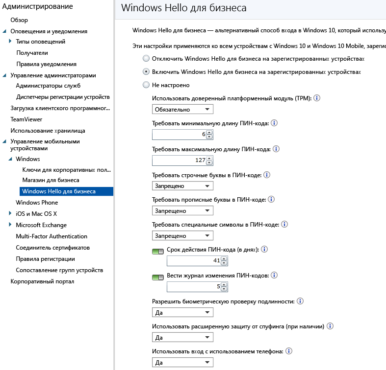

# Управление параметрами Windows Hello для бизнеса на устройствах с помощью Microsoft Intune
Microsoft Intune интегрируется с Windows Hello для бизнеса (предыдущее название — Microsoft Passport for Work). Это альтернативный способ входа с использованием учетной записи Active Directory или Azure Active Directory для замены пароля, смарт-карты или виртуальной смарт-карты.

Hello для бизнеса позволяет использовать для входа *жест пользователя*, а не пароль. Жестом пользователя может быть простой ПИН-код, биометрическая проверка подлинности, например Windows Hello, или внешнее устройство, например считыватель отпечатков пальцев.

Intune интегрируется с Hello для бизнеса двумя способами.

-   Использование политики Intune для управления тем, какие жесты пользователи могут (а какие — не могут) использовать для входа.

-   Хранение сертификатов проверки подлинности в поставщике хранилища ключей (KSP) Windows Hello для бизнеса. Дополнительные сведения см. в разделе [Защита доступа к ресурсам с помощью профилей сертификатов в Microsoft Intune](secure-resource-access-with-certificate-profiles.md).

## Создание политики Windows Hello для бизнеса

1.  В [консоли администрирования Microsoft Intune](https://manage.microsoft.com) последовательно выберите пункты **Администрирование** &gt; **Управление мобильными устройствами** &gt; **Windows** &gt; **Windows Hello для бизнеса**, чтобы открыть страницу Windows Hello для бизнеса.

    

2.  Выберите один из указанных ниже параметров.
    - **Отключить Windows Hello для бизнеса на зарегистрированных устройствах**. Если вы не хотите использовать Windows Hello для бизнеса, выберите этот параметр. После этого все остальные параметры на экране будут отключены.
    - **Включить Windows Hello для бизнеса на зарегистрированных устройствах**. Выберите этот параметр, если вы хотите настроить параметры Windows Hello для бизнеса.
    - **Не настроено**. Выберите этот параметр, если вы не хотите использовать Intune для управления параметрами Windows Hello для бизнеса. Существующие параметры Windows Hello для бизнеса на устройствах с Windows 10 не изменятся. После этого все остальные параметры на экране будут отключены.
3.  Если вы выбрали параметр **Включить Windows Hello для бизнеса на зарегистрированных устройствах**, настройте необходимые параметры, которые будут применяться ко всем зарегистрированным устройствам под управлением Windows 10 и Windows 10 Mobile.
4.  По завершении нажмите кнопку **Сохранить**.

## Настройка политики Windows Hello для бизнеса

- **Использовать доверенный платформенный модуль (TPM)**. TPM обеспечивает дополнительный уровень защиты данных. Выберите одно из следующих значений:
    - **Обязательный** (по умолчанию). Подготовку Windows Hello для бизнеса поддерживают только устройства с доступным доверенным платформенным модулем.
    - **Предпочитаемый**. Устройства сначала пытаются использовать доверенный платформенный модуль. Если он недоступен, они могут использовать шифрование на основе программного обеспечения.
- **Требовать минимальную длину ПИН-кода**/**Требовать максимальную длину ПИН-кода**. Настройте для устройств минимальную и максимальную длину ПИН-кода, чтобы обеспечить защищенный вход. По умолчанию длина ПИН-кода равна 6 символам, но вы можете установить минимальную длину равной 4 символам. Максимальная длина ПИН-кода составляет 127 символов.
- **Требовать строчные буквы в PIN-коде**/**Требовать прописные буквы в PIN-коде**/**Требовать специальные символы в PIN-коде**. Кроме того, можно повысить надежность ПИН-кодов, потребовав использовать в них строчные и прописные буквы, а также специальные символы. Выберите один из следующих типов.
    - **Разрешено**. Пользователи могут использовать символы указанных типов в ПИН-кодах, но это не обязательно.
    - **Обязательно**. Пользователи должны включить по меньшей мере один символ указанного типа в свой ПИН-код. Например, зачастую требуется включать по крайней мере одну прописную букву и один специальный символ.
    - **Не разрешено** (по умолчанию). Пользователи не могут включать символы указанного типа в свой ПИН-код (это поведение также используется, если параметр не настроен). В число специальных символов входят следующие: **! " # $ % &amp; ' ( ) &#42; + , - . / : ; &lt; = &gt; ? @ [ \ ] ^ _ &#96; { &#124; } ~**.
- **Срок действия ПИН-кода (в днях)**. Рекомендуется указывать срок действия ПИН-кода, по истечении которого пользователю необходимо сменить его. Значение по умолчанию — 41 день.
- **Вести журнал изменения ПИН-кодов**. Этот параметр используется для запрета повторного применения ПИН-кодов, которые уже использовались ранее. По умолчанию нельзя использовать повторно последние пять ПИН-кодов.
- **Разрешить биометрическую проверку подлинности**. Включает биометрическую проверку подлинности (например, распознавание лиц или отпечатков пальцев) в качестве альтернативы использованию ПИН-кода для Windows Hello для бизнеса. В случае сбоя биометрической проверки подлинности пользователи по-прежнему должны будут настраивать рабочий ПИН-код. Выберите один из следующих типов.
    - **Да**. Windows Hello для бизнеса разрешает использовать биометрическую проверку подлинности.
    - **Нет**. Windows Hello для бизнеса запрещает использовать биометрическую проверку подлинности (для всех типов учетных записей).
- **Использовать расширенную защиту от спуфинга, когда возможно**. Настраивает использование функций защиты от спуфинга Windows Hello на устройствах, поддерживающих их (например, различение фотографии и настоящего лица). Если задано значение **Да**, Windows требует, чтобы все пользователи прибегали к функции защиты от спуфинга в случае применения возможностей распознавания лиц (если поддерживается).
- **Использовать вход с использованием телефона**. Если этому параметру присвоено значение **Да**, пользователи могут использовать удаленную службу Passport в качестве переносимого устройства-компаньона для проверки подлинности настольного компьютера. Настольный компьютер должен быть присоединен к Azure Active Directory, а устройство-компаньон должно быть настроено для использования ПИН-кода в Windows Hello для бизнеса.

## Дополнительные сведения
Дополнительные сведения о Microsoft Passport см. в [руководстве](https://technet.microsoft.com/library/mt589441.aspx) в документации по Windows 10.

<!--HONumber=Sep16_HO1-->

