# Создание и развертывание политик управления мобильными приложениями с помощью Microsoft Intune
Политики управления мобильными приложениями (MAM) могут применяться к приложениям, которые работают на устройствах, находящихся или не находящихся под управлением Intune. Более подробное описание того, как работают политики MAM и какие сценарии поддерживаются политиками MAM в Intune, см. в разделе [Защита данных приложений с помощью политик управления мобильными приложениями](protect-app-data-using-mobile-app-management-policies-with-microsoft-intune.md).

В этом разделе описывается процедура создания политики MAM на **портале Azure**. Портал Azure — это новая консоль администратора для создания политик MAM, и мы рекомендуем использовать этот портал для создания политик MAM. Портал Azure поддерживает следующие сценарии MAM:
- устройства, зарегистрированные в Intune;
- устройства под управлением решения MDM стороннего производителя;
- устройства, не находящиеся под управлением какого-либо решения MDM (BYOD).

>[!IMPORTANT]

> Если вы используете **консоль администрирования Intune** для управления устройствами, вы можете создать политику MAM, поддерживающую приложения на устройствах, зарегистрированных в Intune, с помощью [этой консоли](configure-and-deploy-mobile-application-management-policies-in-the-microsoft-intune-console.md).
Политики MAM, созданные в консоли администрирования Intune, нельзя импортировать на портал Azure.  Политики MAM потребуется создавать на портале Azure заново.

> В консоли администрирования Intune могут отображаться не все параметры политики MAM. Портал Azure — это новая консоль администрирования для создания политик MAM. При создании политики MAM в консоли администрирования Intune и на портале Azure политики, созданные на портале Azure, применяются к приложениям и разворачиваются для пользователей.

Чтобы просмотреть список параметров политики, поддерживаемых для платформ Android и iOS, выберите один из следующих элементов:

> [!div class="op_single_selector"]
- [Политики iOS](ios-mam-policy-settings.md)
- [Политики Android](android-mam-policy-settings.md)

##  Создание политики MAM
Перед созданием политики MAM ознакомьтесь с [предварительными требованиями и сведениями о поддержке](get-ready-to-configure-mobile-app-management-policies-with-microsoft-intune.md).
1.  Щелкните **Управление мобильными приложениями Intune &gt; Параметры**, чтобы открыть колонку **Параметры**.

    

    > [!TIP]
    > Если вы пользуетесь порталом Azure впервые, сначала ознакомьтесь со статьей [Портал Azure для политик MAM Microsoft Intune](azure-portal-for-microsoft-intune-mam-policies.md), чтобы узнать о возможностях этого портала.

2.  В колонке **Параметры** щелкните **Политика приложения**.  Откроется колонка **Политика приложения**, в которой можно создавать и изменять политики.

    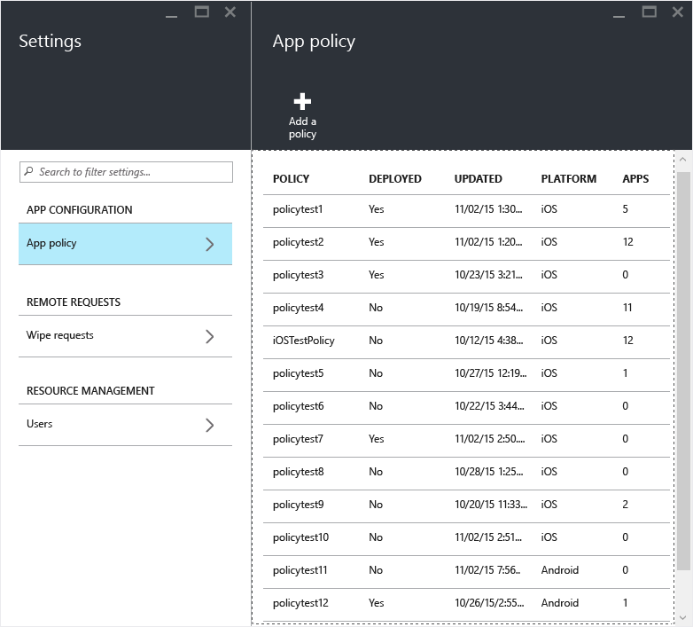

3.  Выберите **Добавить политику**.

    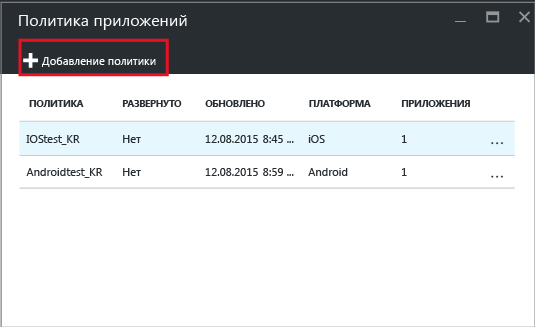

4.  Введите имя для политики, добавьте краткое описание и выберите тип платформы, чтобы создать политику для iOS или Android.  Для каждой платформы можно создать несколько политик.

    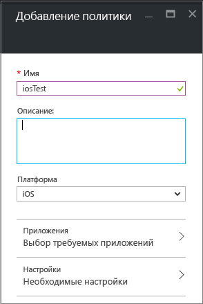

5.  Щелкните **Приложения**, чтобы открыть колонку **Приложения**, где приводится список доступных приложений. В списке можно выбрать одно или несколько приложений, которые вы хотите сопоставить с создаваемой политикой. Выбрав приложения, нажмите кнопку **Выбрать** в нижней части колонки **Приложения**, чтобы сохранить выбранные элементы.

    > [!IMPORTANT]
    > Для создания политики необходимо выбрать хотя бы одно приложение.

6.  В колонке **Добавление политики** щелкните **Настроить обязательные параметры**, чтобы открыть колонку параметров политики.

    Существуют две категории параметров политики: **перемещение данных** и **доступ**.  Политики перемещения данных применяются к перемещению данных в приложение и из него, а политики доступа определяют, как конечный пользователь получает доступ к приложениям в рабочем контексте.
    Чтобы вы быстрее могли приступить к работе, параметры политики снабжены значениями по умолчанию.  Если значения по умолчанию удовлетворяют вашим требованиям, никаких изменений вносить не нужно.

    > [!TIP]
    > Эти параметры политики применяются только при использовании приложения в рабочем контексте.  Когда конечный пользователь применяет приложение в личных целях, эти политики на него не распространяются.

    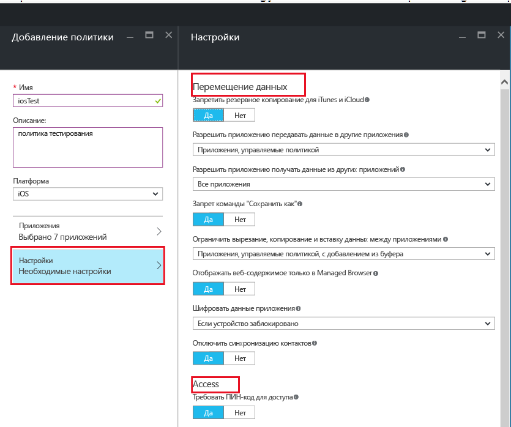

7.  Нажмите кнопку **ОК**, чтобы сохранить конфигурацию.  Выполняется возврат к колонке **Add a policy** (Добавить политику). Щелкните **Создать** для создания политики и сохранения параметров.

    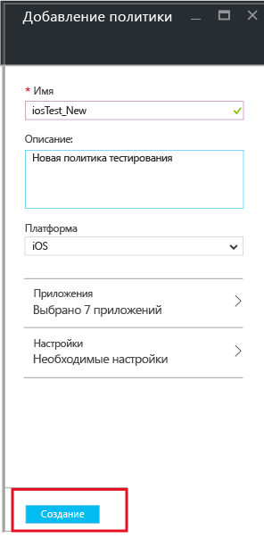

    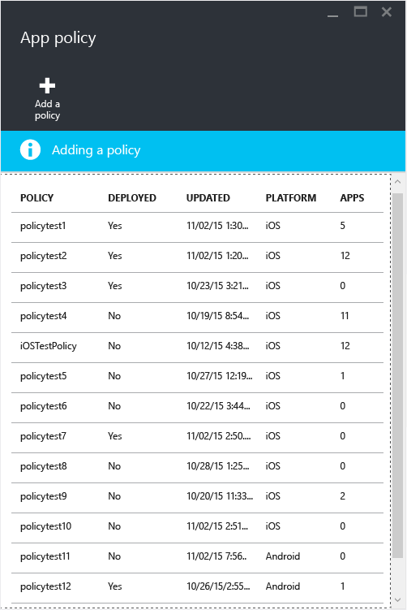

После завершения создания политики, описанного в предыдущей процедуре, политика не развертывается ни для одного из пользователей.  Для развертывания политики выполните описанные ниже действия.

> [!IMPORTANT]
> Если вы создаете политику MAM для приложения с помощью консоли администрирования Intune и политику MAM с помощью портала Azure, то политика, созданная на портале Azure, будет иметь приоритет. При этом функции ведения отчетов в консоли Intune или Configuration Manager будут выводить параметры политики, созданные на портале Azure. Пример.
>
> -   Вы создали в консоли администрирования Intune политику управления мобильными приложениями, которая запрещает копирование из приложения.
> -   Вы создали в консоли Azure политику управления мобильными приложениями, которая разрешает копирование из приложения.
> -   Вы сопоставили обе эти политики с одним и тем же приложением.
> -   В результате приоритет имеет политика, созданная из консоли Azure, поэтому копирование разрешено.
> -   Однако функции отображения состояния и отчеты в консоли Intune неверно указывают, что копирование запрещено.

## Развертывание политики для пользователей

1.  В колонке **Политика** щелкните **Группы пользователей**, чтобы открыть колонку **Группы пользователей**. Выберите пункт **Добавить группу пользователей** в колонке **Группы пользователей**, чтобы открыть колонку **Добавить группу пользователей**.

    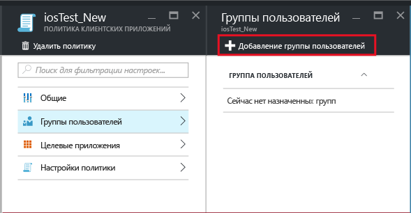

2.  В колонке **Add user group** (Добавить группу пользователей) отображается список групп пользователей. Этот список включает в себя все группы безопасности в вашем **Azure Active Directory**.  Вы можете выбрать группы пользователей, к которым должна применяться эта политика, а затем нажать кнопку **Выбрать**. При нажатии кнопки **Выбрать** политика развертывается для пользователей.

    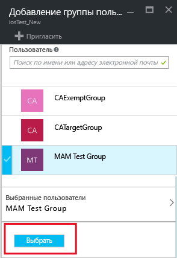

    Вы создали политику и развернули ее для пользователей.

Эта политика будет затрагивать только пользователей с назначенными лицензиями [!INCLUDE[wit_nextref](../includes/wit_nextref_md.md)].  Пользователей из выбранной вами группы безопасности, у которых нет назначенной лицензии [!INCLUDE[wit_nextref](../includes/wit_nextref_md.md)], эта политика не затрагивает.

>[!IMPORTANT]
> При использовании Intune с Configuration Manager для управления устройствами iOS и Android политика применяется только к пользователям, находящимся непосредственно в выбранной вами группе.  Члены дочерних групп, вложенных в выбранную вами группу, не затрагиваются.

Конечные пользователи могут скачать приложения из магазина App Store или Google Play. Подробное пошаговое руководство по защите данных организации на устройствах с помощью MAM см. в разделе [Работа конечных пользователей с приложениями с включенной поддержкой MAM](end-user-experience-for-mam-enabled-apps-with-microsoft-intune.md).

##  Изменение существующих политик
Вы можете изменить существующую политику и применить ее к целевым пользователям. Однако при изменении существующих политик пользователи, которые уже выполнили вход в приложения, не заметят никаких изменений в течение 8 часов.

Чтобы сразу увидеть эффект изменений, пользователям необходимо выйти из приложений и войти снова.

### Изменение списка приложений, сопоставленных с политикой

1.  В колонке **Политика приложения** выберите политику, которую хотите изменить. Открывается колонка, соответствующая недавно выбранной политике.

    

2.  В колонке политики щелкните **Целевые приложения**, чтобы открыть список приложений.

3.  Удалите или добавьте приложения в списке и щелкните **значок сохранения** для сохранения изменений.

### Изменение списка групп пользователей

1.  В колонке **Политика приложения** выберите политику, которую хотите изменить. Открывается колонка, соответствующая выбранной политике.

2.  В колонке политики щелкните **Группы пользователей**, чтобы открыть колонку **Группа пользователей**, в которой приводится список текущих групп пользователей с этой политикой.

3.  Чтобы **добавить новую группу пользователей** в политику, щелкните **Добавить группу пользователей** и выберите группу пользователей. Нажмите кнопку **Выбрать**, чтобы развернуть политику для выбранной группы.

    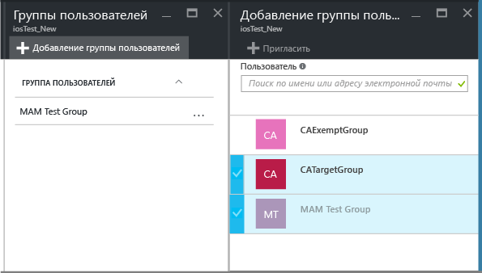

4.  Чтобы **удалить группу пользователей**, выделите ее, щелкните многоточие (…), а затем щелкните **Удалить**.

    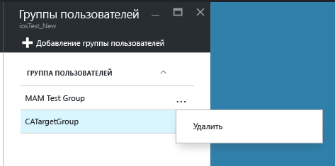

### Изменение параметров политики

1.  В колонке **Политика приложения** выберите политику, которую хотите изменить. Открывается колонка, соответствующая недавно выбранной политике.

    

2.  Щелкните **Параметры политики**, чтобы открыть колонку **Параметры политики**.

3.  Измените параметры и щелкните **значок сохранения** для сохранения изменений.

    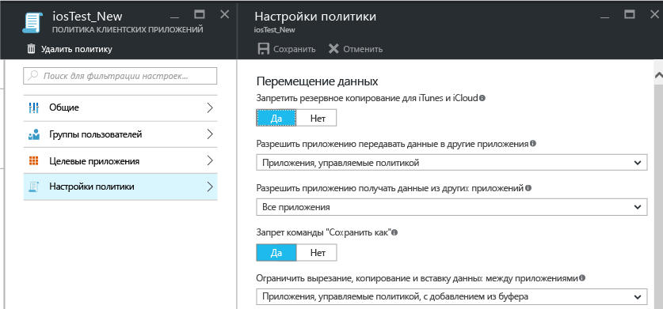

## Параметры политики
Чтобы просмотреть полный список параметров политики для iOS и Android, выберите один из следующих элементов:

> [!div class="op_single_selector"]
- [Политики iOS](ios-mam-policy-settings.md)
- [Политики Android](android-mam-policy-settings.md)

## Дальнейшие действия
[Мониторинг соответствия требованиям и состояния пользователей](monitor-mobile-app-management-policies-with-microsoft-intune.md)

### См. также
[Работа конечных пользователей с приложениями с включенной поддержкой MAM](end-user-experience-for-mam-enabled-apps-with-microsoft-intune.md)

<!--HONumber=Jul16_HO3-->

