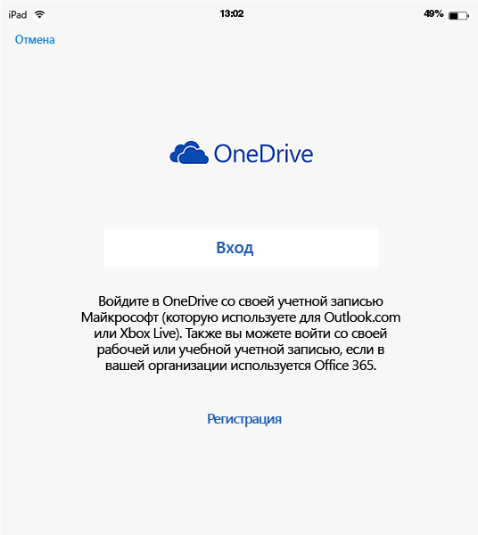
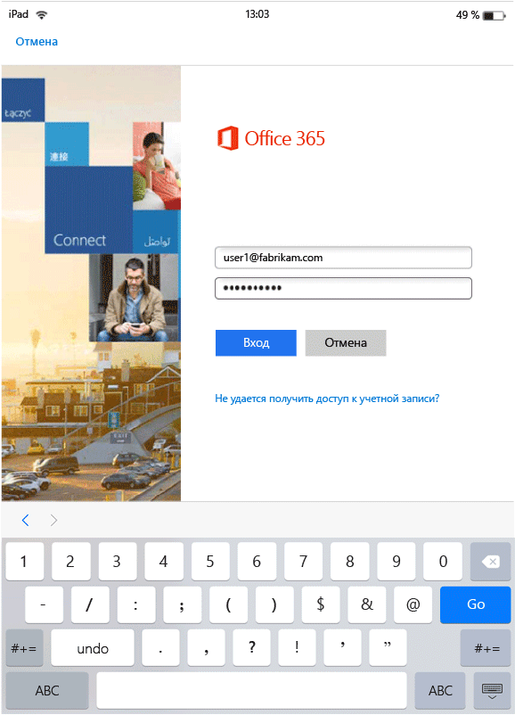
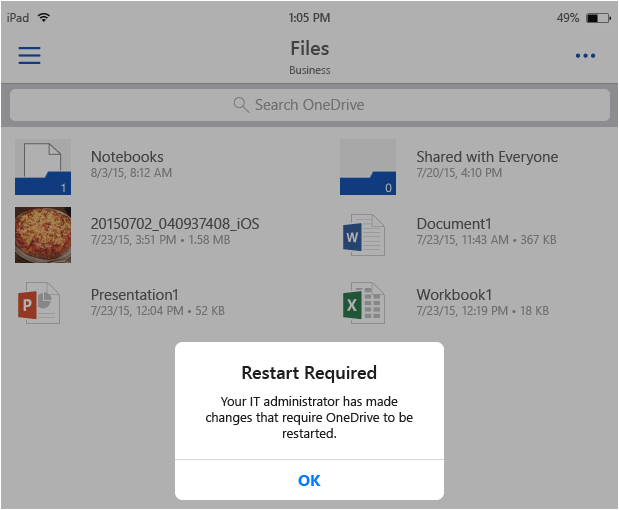
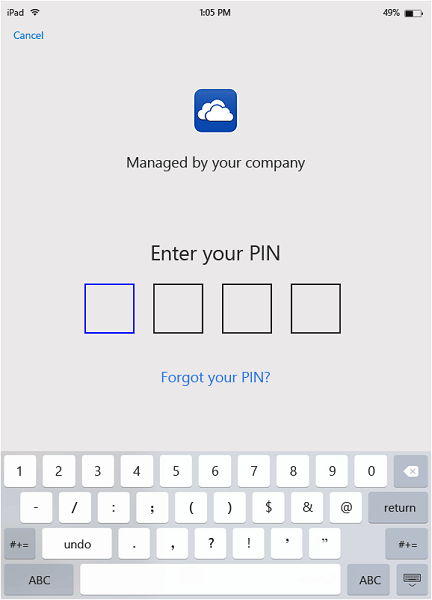
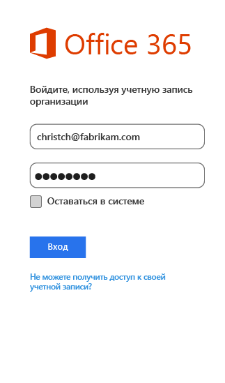
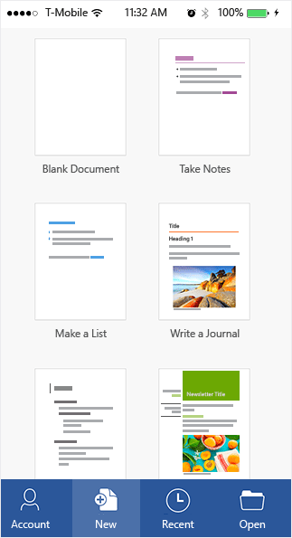
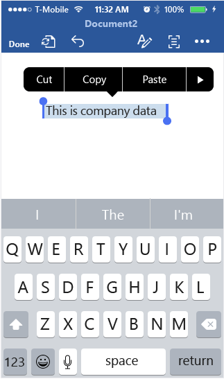

# Работа конечных пользователей с приложениями с включенной поддержкой MAM в Microsoft Intune
Политики управления мобильными приложениями (MAM) применяются только в том случае, если приложения используются в рабочем контексте.  Чтобы понять, как осуществляется работа с управляемыми приложениями, ознакомьтесь с описанными ниже сценариями.
##  Доступ к OneDrive на устройстве iOS

1.  Запустите приложение  **OneDrive** , чтобы открыть страницу входа.

    

    > [!NOTE]
    > На личном устройстве скачивание приложения обычно осуществляет конечный пользователь.  Если устройство управляется с помощью решения MDM, вы можете сами развернуть приложение на устройстве.

2.  Введите имя пользователя вашей рабочей учетной записи. Вы будете перенаправлены на страницу **проверки подлинности Office 365** для ввода рабочих учетных данных.

    

3.  После успешной проверки подлинности ваших учетных данных с помощью Azure AD применяются политики MAM, и вам будет предложено перезапустить приложение **OneDrive** .
  >[Примечание.] Диалоговое окно с указанием необходимости перезапуска отображается только на устройствах, которые не зарегистрированы в Intune.

    

4.  При перезапуске приложение **OneDrive** запускается с включенными политиками MAM. Теперь отображается запрос на задание **ПИН-кода** для приложения (если вы соответствующим образом настроили политику для этого).

    

5.  После указания и подтверждения ПИН-кода вы получите доступ к файлам в вашем хранилище **OneDrive для бизнеса**.

    

    > [!NOTE]
    > При модификации развернутой политики изменения применяются при следующем открытии приложения.

##  Доступ к OneDrive на устройстве Android

1.  Запустите приложение OneDrive, чтобы открыть страницу входа.

    > [!NOTE]
    > На личном устройстве скачивание приложения обычно осуществляет конечный пользователь.  Если устройство управляется с помощью решения MDM, вы можете сами развернуть приложение на устройстве.

2.  Введите имя пользователя вашей рабочей учетной записи. Вы будете перенаправлены на страницу **проверки подлинности Office 365** для ввода рабочих учетных данных.

    

3.  После успешной проверки подлинности ваших учетных данных с помощью **Azure AD**вы увидите сообщение с инструкциями по установке приложения корпоративного портала, если оно еще не установлена на этом устройстве.  Коснитесь элемента **Получить приложение** для продолжения.

>[!NOTE]
>Приложение "Портал организации" требуется для всех приложений, связанных с политиками MAM на устройствах Android. На устройствах, не зарегистрированных в Intune, приложение должно быть установлено, но его не требуется запускать и выполнять вход в приложение.  

  

4.  Теперь вы находитесь в магазине **Google Play** , откуда можно скачать и установить приложение **корпоративного портала** .

    Приложение корпоративного портала позволяет обеспечить безопасность и защиту данных.

    

5.  После завершения установки нажмите кнопку **Принять**, чтобы принять условия использования.

6.  Автоматически запускается приложение **OneDrive** .

7.  При следующем открытии OneDrive отображается запрос на задание **ПИН-кода**, если параметры политики настроены на запрос ПИН-кода для доступа к приложению **OneDrive** .

    

8.  После задания и подтверждения ПИН-кода вы можете продолжить работу с приложением **OneDrive**, которое теперь управляется политиками приложений.

##  Использование приложений с поддержкой множественной идентификации
В этом сценарии в качестве примера используется приложение Microsoft Word.

1.  Откройте приложение **Word** на устройстве. Мы демонстрируем необходимые шаги на примере устройства iOS.

2.  Коснитесь элемента **Создать** для создания нового документа Word.

    

3.  Введите предложение по своему усмотрению.  При попытке сохранить этот документ на выбор предлагаются как рабочие, так и личные расположения.  На данном этапе политики приложений еще не применяются, так как этот рабочий/личный контекст еще не задан.

4.  Сохраните документ в вашем хранилище OneDrive для бизнеса. Теперь этот документ помечен как данные компании, и к нему применяются накладываемые политиками ограничения.

    

5.  Откройте документ, сохраненный в рабочем расположении.  Скопируйте текст, откройте личную учетную запись **Facebook** и попытайтесь вставить скопированный текст.  Вы увидите, что вставить содержимое в новую запись Facebook не удается. Параметр вставки доступен, однако при нажатии элемента **Вставить**ничего не происходит.

    

    

6.  Теперь повторите шаги 2 и 3, чтобы создать еще один документ, введите любое предложение и сохраните документ не в рабочем, а в личном расположении, например в **личном хранилище OneDrive**.

    

7.  Откройте сохраненный личный документ.  Скопируйте текст, откройте приложение **Facebook** и попытайтесь вставить скопированный текст. Вы увидите, что содержимое вставляется в публикацию Facebook.

    

##  Управление учетными записями пользователей

Intune поддерживает развертывание политик MAM только для одной учетной записи на каждом устройстве. Если на устройстве несколько рабочих учетных записей, политики MAM управляют только одной из них.

В зависимости от приложения второй пользователь может блокироваться или не блокироваться на устройстве. Однако в любом случае политики MAM затрагивают только первого пользователя, к которому они применяются.

Если до развертывания политик MAM на устройстве имелось несколько учетных записей пользователей, политики MAM Intune управляют только той из них, для которой они были развернуты первыми.

В приложениях **Microsoft Word**, **Excel** и **PowerPoint** вторая учетная запись пользователя не блокируется, но политики MAM ее не затрагивают.  

Для **приложений OneDrive и Outlook** можно использовать только одну рабочую учетную запись.  Эти приложения блокируют возможность добавления нескольких рабочих учетных записей.  Однако вы можете удалить пользователя и добавить другого пользователя на устройстве.

Чтобы лучше понять, что происходит в ситуации с несколькими учетными записями пользователей, ознакомьтесь с приведенным ниже примером.

Пользователь A работает в двух организациях: **организации X** и **организации Y**. У пользователя A есть рабочая учетная запись в каждой организации, и в каждой используется Intune для развертывания политик MAM. **Организация X** развертывает политики MAM **раньше, чем**** организация Y**. К учетной записи, связанной с **организацией X**, будет применена политика MAM, а к учетной записи, связанной с организацией Y, — нет. Если нужно, чтобы политики MAM управляли учетной записью пользователя, связанной с организацией Y, следует удалить учетную запись, связанную с организацией X.
### Добавление второй учетной записи
#### iOS
Если вы используете устройство iOS, при попытке добавить вторую рабочую учетную запись на то же самое устройство может появиться сообщение о блокировке.  Кроме того, вам предоставляется возможность удалить существующую учетную запись и добавить новую. Это можно сделать, выбрав **Да**.

####  Android
При использовании устройства Android вы можете увидеть сообщение о блокировке с инструкциями по удалению существующей и добавлению новой учетной записи.  Чтобы удалить существующую учетную запись на устройстве Android, выберите **Параметры &gt;Общие &gt; Диспетчер приложений &gt; Корпоративный портал, а затем "Очистить данные"**.

##  Просмотр мультимедиа с помощью приложения Azure Information Protection (ранее известного как приложение для управления доступом Microsoft Rights Management)
Для просмотра корпоративных звуковых и видеофайлов, PDF-файлов и файлов изображений на устройствах Android используйте [приложение Azure Information Protection](https://play.google.com/store/apps/details?id=com.microsoft.ipviewer).

Его можно скачать в магазине Google Play.  

Поддерживаются следующие типы файлов:

* **Аудио:** AAC LC, HE-AACv1 (AAC+), HE-AACv2 (улучшенный AAC+), AAC ELD (улучшенный AAC с низкой задержкой), AMR-NB, AMR-WB, FLAC, MP3, MIDI, Vorbis, PCM/WAVE.
* **Видео:** H.263, H.264 AVC, MPEG-4 SP, VP8.
* **Изображения:** jpg, pjpg, png, ppng, bmp, pbmp, gif, pgif, jpeg, pjpeg.
* **PDF, PPDF**

------------
|**pfile**|**text**|
|----|----|
|Pfile — это универсальный формат-"оболочка" для защищенных файлов, в котором объединяются зашифрованное содержимое и лицензии Azure Information Protection. Его можно использовать для защиты файлов любого типа.|Текстовые файлы, в том числе XML, CSV и т. д., можно открыть для просмотра в приложении, даже если они защищены. Типы файлов: txt, ptxt, csv, pcsv, log, plog, xml, pxml.|
---------------

### См. также
[Создание и развертывание политик управления мобильными приложениями с помощью Microsoft Intune](create-and-deploy-mobile-app-management-policies-with-microsoft-intune.md)

<!--HONumber=Oct16_HO1-->

