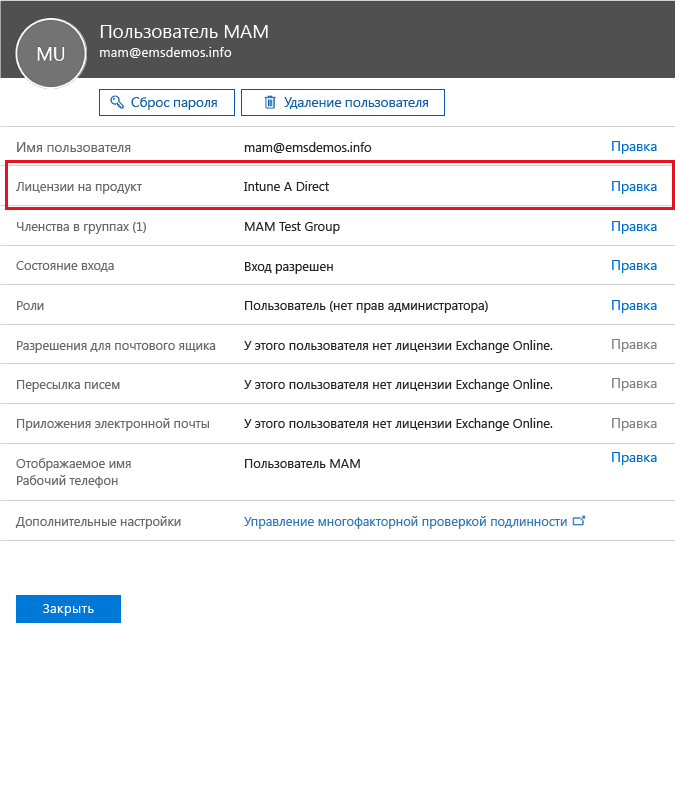
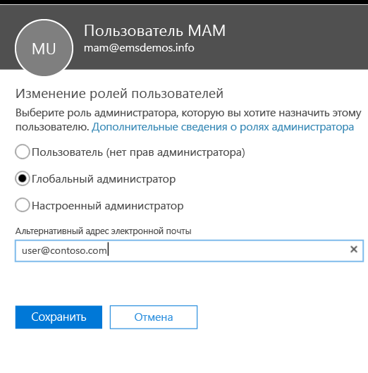
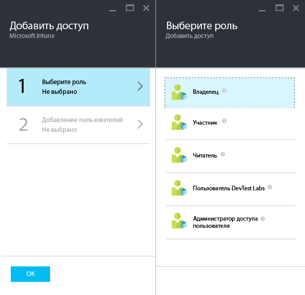

# Подготовка к настройке политик управления мобильными приложениями в Microsoft Intune
В этом разделе описывается, что необходимо для того, чтобы приступить к созданию политик управления мобильными приложениями (MAM) на портале Azure.

Портал Azure — это новая консоль администрирования для создания политик MAM. Мы рекомендуем использовать этот портал для создания политик MAM. Портал Azure поддерживает следующие сценарии MAM:
- устройства, зарегистрированные в Intune;
- устройства под управлением решения MDM стороннего производителя;
- устройства, не находящиеся под управлением решения MDM (BYOD).

Если вы не знакомы с порталом Azure, прочтите раздел [Портал Azure для политик управления мобильными приложениями Microsoft Intune](azure-portal-for-microsoft-intune-mam-policies.md), чтобы получить краткий обзор.

>[!IMPORTANT]

> При использовании консоли администрирования Intune для управления устройствами можно создать политики MAM, поддерживающие приложения на устройствах, зарегистрированных в Intune, с помощью этой консоли. Но мы рекомендуем использовать портал Azure даже для устройств, зарегистрированных в Intune. Инструкции по созданию политики MAM с помощью консоли администрирования Intune см. в статье [Настройка и развертывание политик управления мобильными приложениями в консоли Microsoft Intune](configure-and-deploy-mobile-application-management-policies-in-the-microsoft-intune-console.md).

> В консоли администрирования Intune могут отображаться не все параметры политики MAM. При создании политик MAM в консоли администрирования Intune и на портале Azure политики, созданные на портале Azure, применяются к приложениям и развертываются для пользователей.
> Политики MAM, созданные в консоли администрирования Intune, нельзя импортировать на портал Azure.  Их требуется создавать на портале Azure заново.

##  Поддерживаемые платформы
- iOS 8.1 или более поздняя версия

- Android 4 или более поздняя версия

Устройства с Windows сейчас не поддерживаются.
##  Поддерживаемые приложения
* **Приложения Майкрософт**. Эти приложения содержат встроенные пакеты SDK для приложений Intune и не требуют дополнительных действий перед применением политик MAM.
Чтобы просмотреть полный список поддерживаемых приложений Майкрософт, перейдите в [коллекцию мобильных приложений Microsoft Intune](https://www.microsoft.com/en-us/server-cloud/products/microsoft-intune/partners.aspx) на странице партнеров приложений Microsoft Intune. Выберите приложение, чтобы просмотреть поддерживаемые сценарии и платформы, а также сведения о поддержке нескольких удостоверений.
* **Бизнес-приложения вашей организации**. Эти приложения необходимо подготовить для включения пакета SDK приложений Intune перед применением политик MAM.

  * Для устройств под управлением Intune см. раздел [Выбор способа подготовки приложений для MAM](decide-how-to-prepare-apps-for-mobile-application-management-with-microsoft-intune.md).
  * Для устройств, которые не управляются (например, устройства сотрудников) или управляются с помощью стороннего решения по управлению мобильными устройствами, см. статью [Защита бизнес-приложений и данных на незарегистрированных устройствах](protect-line-of-business-apps-and-data-on-devices-not-enrolled-in-microsoft-intune.md).

*Перед* настройкой политик MAM вам требуются:

-   Подписка Microsoft Intune.    Пользователям нужны лицензии [!INCLUDE[wit_nextref](../includes/wit_nextref_md.md)] для получения приложений с политиками MAM.

-   Подписка Office 365, которая требуется в следующих целях:
  - для применения политик MAM к приложениям с поддержкой нескольких удостоверений;
  - для создания рабочих учетных записей SharePoint Online и Exchange Online. Локальные версии Exchange и SharePoint не поддерживаются.
-   Настройка Skype для бизнеса Online для современной проверки подлинности. Дополнительные сведения см. в статье о [включении современной проверки подлинности](http://social.technet.microsoft.com/wiki/contents/articles/34339.skype-for-business-online-enable-your-tenant-for-modern-authentication.aspx.md).

- Azure Active Directory (Azure AD) для создания пользователей. Azure AD выполняет аутентификацию пользователей, когда они открывают приложение и вводят рабочие учетные данные.

    > [!NOTE]
    > При настройке пользователей с помощью консоли [!INCLUDE[wit_nextref](../includes/wit_nextref_md.md)] конфигурация политик MAM перемещается на портал Azure. Чтобы использовать этот портал, необходимо настроить группы пользователей Azure AD с помощью портала Office 365.

## Создание пользователей и назначение лицензий Microsoft Intune

1. Убедитесь, что у вас есть подписка Intune. У вас уже есть подписка [!INCLUDE[wit_nextref](../includes/wit_nextref_md.md)], если вы используете [!INCLUDE[wit_nextref](../includes/wit_nextref_md.md)] для управления устройствами.  Вы также располагаете подпиской [!INCLUDE[wit_nextref](../includes/wit_nextref_md.md)], если приобрели лицензию Enterprise Mobility Suite. Если вы используете [!INCLUDE[wit_nextref](../includes/wit_nextref_md.md)], чтобы ознакомиться с возможностями MAM, пробную учетную запись можно получить на [веб-странице Microsoft Intune](http://www.microsoft.com/en-us/server-cloud/products/microsoft-intune/).

    Чтобы проверить, есть ли у вас подписка [!INCLUDE[wit_nextref](../includes/wit_nextref_md.md)], перейдите на страницу **Выставление счетов** на портале Office.  В списке подписок для [!INCLUDE[wit_nextref](../includes/wit_nextref_md.md)] должно быть указано значение **Активно**.

2.  Войдите на [портал Office](http://portal.office.com), используя свои учетные данные администратора.

3.  Перейдите на страницу **Активные пользователи**, чтобы добавить пользователей и назначить лицензии [!INCLUDE[wit_nextref](../includes/wit_nextref_md.md)].

    

    

4.  Чтобы предоставить пользователю возможность доступа к порталу Office, порталу Azure AD и порталу Azure, назначьте ему роль **глобального администратора**.

    

5.  Политики MAM развертываются для групп пользователей в Azure Active Directory. Чтобы создать группы пользователей для политик MAM, перейдите на страницу **Группы** портала Office и в верхнем меню выберите параметр **Добавить группу** для создания группы безопасности.  Введите имя и описание, а затем щелкните **Создать**. Как только группа будет создана, вы сможете добавлять в нее пользователей, щелкнув **Edit members** (Изменить участников). Группа безопасности создается в Azure Active Directory.

    

В таблице ниже перечислены роли и разрешения, которые можно назначать пользователям с правами администратора.

|||
|--|----|
|**Роль**|**Разрешения**|
|Глобальный администратор (портал Office 365)|Доступ на портал Office 365 и портал Azure AD.  Доступ на портал Azure (позволяет выполнять задачи как по управлению ролями, так и по управлению мобильными приложениями)|
|Владелец (портал Azure)|Доступ на портал Azure (позволяет выполнять задачи как по управлению ролями, так и по управлению мобильными приложениями)|
|Участник (портал Azure)|Доступ на портал Azure (позволяет выполнять только задачи по управлению мобильными приложениями)|

## Назначение роли участника пользователю

Глобальные администраторы имеют доступ на [портал Azure](https://portal.azure.com).  Если вы хотите, чтобы другие пользователи с правами администратора могли настраивать политики и выполнять другие задачи по управлению мобильными приложениями, можете назначить пользователю роль участника.

1.  В колонке **Параметры** раздела **Управление ресурсами** щелкните **Пользователи**.

    

2.  Щелкните **Добавить** , чтобы открыть колонку **Добавить доступ** .

3.  Щелкните **Выберите роль**, а затем **Участник**.

    

4.  Щелкните **Добавить пользователей** и выполните поиск пользователя по имени или электронному адресу. В этом списке отображаются первые 1000 пользователей, ранее созданные в Azure AD с использованием портала Office. Чтобы сохранить изменения и назначить роль пользователю, нажмите кнопку **ОК** в колонке **Добавить доступ**.

    

    > [!IMPORTANT]
    > Если выбран пользователь, у которого нет назначенной лицензии [!INCLUDE[wit_nextref](../includes/wit_nextref_md.md)], он не сможет получить доступ к порталу.

## Дальнейшие действия
[Создание и развертывание политик управления мобильными приложениями с помощью Microsoft Intune](create-and-deploy-mobile-app-management-policies-with-microsoft-intune.md)

<!--HONumber=Jul16_HO4-->

