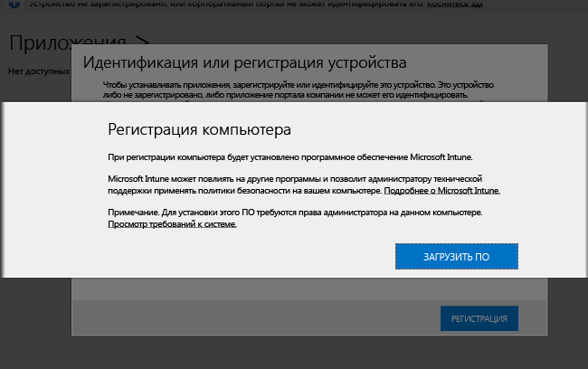

# Установка программного клиента Intune на компьютерах Windows
Компьютеры под управлением Windows можно зарегистрировать с помощью установки клиентского программного обеспечения Intune. Клиентское программное обеспечение Intune можно установить одним из следующих способов:

- Установка вручную
- Установка с помощью групповой политики
- Включение в образ диска
- Установка пользователями

## Скачивание клиентского программного обеспечения Intune

Во всех методах, кроме самостоятельной установки клиентского программного обеспечения Intune пользователями, требуется скачать программное обеспечение для дальнейшего развертывания.

1.  В [консоли администрирования Microsoft Intune](https://manage.microsoft.com/) выберите **Администрирование** &gt; **Загрузить клиентское программное обеспечение**.

  

2.  На странице **Загрузка клиентского программного обеспечения** нажмите кнопку **Загрузить клиентское программное обеспечение** и сохраните пакет **Microsoft_Intune_Setup.zip** с ПО в надежной сетевой папке.

    > [!NOTE]
    > Пакет установки клиентского программного обеспечения Intune содержит данные о вашей учетной записи. Если доступ к установочному пакету получат неавторизованные пользователи, они смогут зарегистрировать компьютеры в учетной записи, указанной во внедренном сертификате.

3.  Извлеките содержимое пакета установки и сохраните его в надежной сетевой папке.

    > [!IMPORTANT]
    > Не переименовывайте и не перемещайте извлеченный файл **ACCOUNTCERT**, так как в противном случае установка клиентского программного обеспечения будет невозможна.

## Развертывание вручную

1.  На компьютере перейдите к папке с файлами установки клиентского программного обеспечения, а затем запустите файл **Microsoft_Intune_Setup.exe**, чтобы установить клиентское программное обеспечение.

    > [!NOTE]
    > Состояние установки отображается при наведении указателя мыши на значок на панели задач клиентского компьютера.

## Развертывание с помощью групповой политики

1.  В папке с файлами **Microsoft_Intune_Setup.exe** и **MicrosoftIntune.accountcert** выполните следующую команду для извлечения программ установки установщика Windows для 32- и 64-разрядных компьютеров.

    ```
    Microsoft_Intune_Setup.exe/Extract <destination folder>
    ```

2.  Скопируйте файлы **Microsoft_Intune_x86.msi**, **Microsoft_Intune_x64.msi** и **MicrosoftIntune.accountcert** в сетевую папку, доступную всем компьютерам, на которых будет установлено клиентское программное обеспечение.

    > [!IMPORTANT]
    > Не переименовывайте и не разделяйте файлы, так как в этом случае установка клиентского программного обеспечения не будет выполнена.

3.  С помощью групповой политики разверните программное обеспечение на компьютерах в сети.

    Дополнительные сведения об использовании групповой политики для автоматического развертывания программного обеспечения см. в документации к Windows Server.

## Установка в составе образа
Клиентское программное обеспечение Intune можно развернуть в составе образа операционной системы, выполнив следующую приведенную в качестве примера процедуру.

1.  Скопируйте файлы установки клиента, **Microsoft_Intune_Setup.exe** и **MicrosoftIntune.accountcert**, в папку **%Systemdrive%\Temp\Microsoft_Intune_Setup** на эталонном компьютере.

2.  Создайте запись реестра **WindowsIntuneEnrollPending**, добавив в сценарий **SetupComplete.cmd** следующую команду:

    ```
    %windir%\system32\reg.exe add HKEY_LOCAL_MACHINE\Software\Microsoft\Onlinemanagement\Deployment /v
    WindowsIntuneEnrollPending /t REG_DWORD /d 1
    ```

3.  Добавьте следующую команду в сценарий **setupcomplete.cmd**, чтобы запустить пакет регистрации с аргументом /PrepareEnroll:

    ```
    %systemdrive%\temp\Microsoft_Intune_Setup\Microsoft_Intune_Setup.exe /PrepareEnroll
    ```
    > [!TIP]
    > Сценарий **SetupComplete.cmd** позволяет программе установки Windows вносить изменения в систему до того, как пользователь выполнит вход. Аргумент командной строки **/PrepareEnroll** подготавливает целевой компьютер к автоматической регистрации в Intune после того, как программа установки Windows завершит работу.

4.  Поместите **SetupComplete.cmd** в папку **%Windir%\Setup\Scripts** на эталонном компьютере.

5.  Запишите образ эталонного компьютера, а затем разверните его на целевых компьютерах.

После перезагрузки целевого компьютера по завершении выполнения программы установки Windows будет создан раздел реестра **WindowsIntuneEnrollPending**. Пакет регистрации проверяет, зарегистрирован ли компьютер. Если компьютер зарегистрирован, дальнейшие действия не предпринимаются. Если компьютер не зарегистрирован, пакет регистрации создает задачу автоматической регистрации в Microsoft Intune.

При следующем запланированном запуске задачи автоматической регистрации выполняется проверка на наличие параметра реестра **WindowsIntuneEnrollPending** и предпринимается попытка регистрации целевого компьютера в Intune. Если по какой-либо причине выполнить регистрацию не удается, при следующем запуске задачи будет предпринята повторная попытка. Попытки продолжаются в течение одного месяца.

После успешной регистрации или через один месяц задача автоматической регистрации Intune, значение реестра **WindowsIntuneEnrollPending** и сертификат учетной записи удаляются с целевого компьютера.

## Инструктирование пользователей по самостоятельной регистрации

Пользователи могут устанавливать клиентское программное обеспечение Intune, перейдя на страницу [http://portal.manage.microsoft.com](http://portal..manage.microsoft.com). Если веб-порталу удается определить, что устройство является компьютером под управлением Windows, он предлагает зарегистрировать этот компьютер, скачав программный клиент Intune. После скачивания пользователи могут установить это программное обеспечение, чтобы включить свои ПК в систему управления.



## Отслеживание и проверка успешного развертывания клиента
Для отслеживания и проверки успешного развертывания клиента можно использовать любую из следующих процедур.

### Проверка установки клиентского программного обеспечения с консоли администрирования Microsoft Intune

1.  В [консоли администрирования Microsoft Intune](https://manage.microsoft.com/) выберите **Группы** &gt; **Все устройства** &gt; **Все компьютеры**.

2.  В списке компьютеров найдите управляемые компьютеры, взаимодействующие с Intune. Кроме того, можно найти конкретный управляемый компьютер, указав его имя целиком (или любую часть имени) в поле **Поиск устройств**.

3.  Проверьте состояние компьютера в нижней части консоли и устраните возможные ошибки.

### Создание отчета об инвентаризации компьютеров для отображения всех зарегистрированных компьютеров

1.  В [консоли администрирования Microsoft Intune](https://manage.microsoft.com/) выберите **Отчеты** &gt; **Отчеты об инвентаризации компьютеров**.

2.  На странице **Создание нового отчета** оставьте все значения по умолчанию (если не требуется применять фильтры) и нажмите кнопку **Просмотреть отчет**.

3.  В новом окне откроется страница **Отчет об инвентаризации компьютеров** со списком всех компьютеров, успешно зарегистрированных в Intune.

    > [!TIP]
    > Чтобы отсортировать список по содержимому столбца, щелкните заголовок столбца.


### См. также
[Управление компьютером с Windows с помощью Microsoft Intune](manage-windows-pcs-with-microsoft-intune.md)
[Устранение неполадок при настройке клиента](../troubleshoot/troubleshoot-client-setup-in-microsoft-intune)


<!--HONumber=Sep16_HO1-->


