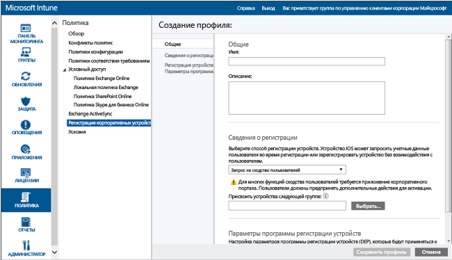

# Прямая регистрация устройств iOS с помощью Apple Configurator
Intune поддерживает регистрацию корпоративных устройств iOS с помощью средства [Apple Configurator](http://go.microsoft.com/fwlink/?LinkId=518017), запущенного на компьютере Mac. Этот процесс сбрасывает настройки устройства до заводских и регистрирует устройство с предопределенной политикой. Этот метод предназначен для устройств в режиме **Без сопоставления пользователей** и требует подключить устройство iOS к USB-порту на компьютере Mac для настройки корпоративной регистрации. Для выполнения прямой регистрации устройств iOS не требуется серийный номер устройства. Кроме того, в целях идентификации можно указать имя устройства, которое будет использоваться Intune во время регистрации. Приложение корпоративного портала не поддерживается для устройств с прямой регистрацией. В этом руководстве предполагается, что вы используете Apple Configurator 2.0 на компьютере Mac.

1.  **Создание профиля для устройств**. В профиле регистрации устройств задаются параметры, применяемые к устройствам. Создайте профиль регистрации устройств для устройств iOS, зарегистрированных с помощью Apple Configurator, если вы еще этого не сделали.

    1.  В [консоли администрирования Microsoft Intune](http://manage.microsoft.com) перейдите в меню **Политика** &gt; **Регистрация корпоративных устройств** и нажмите кнопку **Добавить...**.

        

    2.  Введите сведения для профилей устройств.

        -   **Имя** — имя профиля регистрации устройства. Не отображается для пользователей.

        -   **Описание** — описание профиля регистрации устройства. Не отображается для пользователей.

        -   **Принадлежность пользователю** — указывает способ регистрации устройств. Для прямой регистрации выберите **Без соответствия пользователей**.

        -   **Предварительное назначение группы устройств** — все устройства, развернувшие данный профиль, будут изначально принадлежать к этой группе. После регистрации можно повторно назначить устройства.

            [!INCLUDE[groups deprecated](../includes/group-deprecation.md)]

    3.  Нажмите кнопку **Сохранить профиль**, чтобы добавить профиль.

5.  **Экспорт профиля в качестве MOBILECONFIG-файла для развертывания на устройствах с iOS**. Выберите созданный профиль устройства. Выберите **Экспортировать...** на панели задач. Выберите **Загрузить профиль** и сохраните загруженный MOBILECONFIG-файл.

6.  **Перемещение файла**. Скопируйте скачанный MOBILECONFIG-файл на компьютер Mac.
    > [!NOTE]
    > URL-адрес профиля регистрации действителен в течение двух недель с момента экспорта. По истечении двух недель необходимо экспортировать новый URL-адрес профиля регистрации для регистрации устройств iOS с помощью помощника по настройке.
7.  **Подготовка устройства с помощью Apple Configurator**. Устройства с iOS подключаются к компьютеру Mac и регистрируются в системе управления мобильными устройствами.

    1.  На компьютере Mac запустите **Apple Configurator 2.0**.

    2.  Подключите устройство iOS к компьютеру Mac с помощью кабеля USB. При обнаружении устройства закройте **Фотографии**, **iTunes** и другие приложения, открытые на устройстве.

    3.  В Apple Configurator щелкните подключенное устройство с iOS и нажмите кнопку **Add** (Добавить). В раскрывающемся списке отображаются параметры, которые могут быть добавлены к устройству. Выберите **Profiles** (Профили).

    4.  Используйте средство выбора файлов, чтобы выбрать MOBILECONFIG-файл, экспортированный из Intune, и нажмите кнопку **Add** (Добавить). Профиль будет добавлен в устройство.  Если устройство настроено как **Неконтролируемое**, для установки потребуется подтверждение на устройстве.

8.  **Установка профиля**. Все готово для установки профиля на устройство с iOS. Помощник по настройке уже должен завершить свою работу, и устройство должно быть готово к использованию.  Если регистрации влечет за собой развертывания приложений, то у устройства должен быть задан Apple ID, так как для развертывания приложений необходимо выполнить вход в Магазин приложений с Apple ID.

    1.  Разблокируйте устройство iOS.

    2.  В диалоговом окне **Установка профиля** щелкните **Профиль управления**, а затем **Установить**.

    3.  Укажите **Секретный код устройства** или **Apple ID**, если это необходимо.

    4.  Примите **Предупреждение** и нажмите кнопку **Установить**.

    5.  Примите **Удаленное предупреждение** и нажмите кнопку **Доверяю**.

    6.  Когда состояние профиля в окне **Profile Installed** (Профиль установлен) изменится на **Installed** (Установлен), нажмите кнопку **Done** (Готово).

9. **Проверка профиля**
   . На устройстве с iOS откройте **Settings** (Настройки), выберите **General** (Общие) &gt; **Device Management** (Управление устройствами) &gt; **Management Profile** (Профиль управления) &gt; и убедитесь, что профиль установлен. Затем проверьте ограничения политики iOS и установленные приложения. Для появления на устройстве ограничений политик и приложений может потребоваться до 10 минут.

10. **Распределение устройств**. Теперь устройство с iOS зарегистрировано в Intune и является управляемым.

<!--HONumber=Jul16_HO3-->

