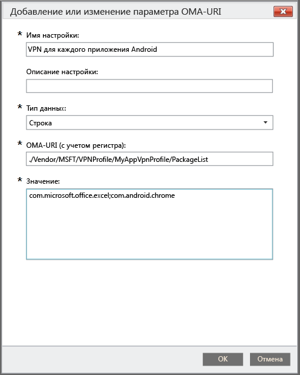

# Используйте настраиваемую политику для создания профиля VPN на уровне приложения для устройств Android

Для устройств Android 5.0 и более поздней версии, находящихся под управлением Intune, можно создать профиль VPN на уровне приложения. Сначала создайте профиль VPN, который использует тип подключения Pulse Secure. Затем создайте настраиваемую политику конфигурации, которая связывает профиль VPN с конкретным приложением. 

После развертывания политики для групп пользователей или устройств Android пользователям следует запустить VPN PulseSecure. PulseSecure позволит использовать VPN-подключение только для трафика из указанных приложений.

> [!NOTE]
>
> Для этого профиля поддерживается только тип подключения Pulse Secure.

### Шаг 1. Создание профиля VPN

1. В [консоли администрирования Microsoft Intune](https://manage.microsoft.com) выберите **Политика** > **Добавить политику**.
2. Выберите шаблон для новой политики, развернув узел **Android** и выбрав **профиль VPN (Android 4 и более поздней версии)**.
3. В поле **Тип подключения** для шаблона выберите **Pulse Secure**.
4. Завершите процедуру и сохраните профиль VPN. Дополнительные сведения о профилях VPN см. в статье [Подключения VPN](../deploy-use/vpn-connections-in-microsoft-intune.md).

> [!NOTE]
>
> Запишите имя профиля VPN для использования на следующем шаге. Например, MyAppVpnProfile.

### Шаг 2. Создание настраиваемой политики конфигурации

   1. В консоли администрирования Intune выберите **Политика** > **Добавить политику** > **Android** > **Настраиваемая конфигурация** > **Создать политику**.
   2. Введите имя политики.
   3. В разделе **Параметры OMA-URI** нажмите кнопку **Добавить**.
   4. Введите имя параметра.
   5. В поле **Тип данных** укажите **Строка**.
   6. В поле **OMA-URI** укажите следующую строку: **./Vendor/MSFT/VPN/Profile/*Name*/PackageList**, где *Name* — имя профиля VPN, записанное на шаге 1. В нашем примере строка будет такой: **./Vendor/MSFT/VPN/Profile/MyAppVpnProfile/PackageList**.
   7.   В поле **Значение** укажите имена пакетов, которые должны быть связаны с профилем, разделяя их точкой с запятой. Например, если вы хотите, чтобы VPN-подключение использовали Excel и браузер Google Chrome, введите: **com.microsoft.office.excel;com.android.chrome**.

#### Отметьте список приложений как список разрешенных или запрещенных (необязательно)
  Приложениям в списке можно *запретить* использование VPN-подключения. Для этого укажите значение **BLACKLIST**. Все остальные приложения будут подключаться через VPN.
Кроме того, можно использовать значение **WHITELIST**, чтобы указать список приложений, которым *разрешено* использовать VPN-подключение. Приложения, которые не входят в список, не будут подключаются через VPN.
  1.    В разделе **Параметры OMA-URI** нажмите кнопку **Добавить**.
  2.    Введите имя параметра.
  3.    В поле **Тип данных** укажите **Строка**.
  4.    В поле **OMA-URI** укажите следующую строку: **./Vendor/MSFT/VPN/Profile/*Name*/Mode**, где *Name* — имя профиля VPN, записанное на шаге 1. В нашем примере строка будет такой: **./Vendor/MSFT/VPN/Profile/MyAppVpnProfile/Mode**.
  5.    В поле **Значение** введите **BLACKLIST** или **WHITELIST**.

### Шаг 3. Развертывание обеих политик

*Обе* политики необходимо развернуть в *одни и те же* группы Intune.

1.  В рабочей области **Политика** выберите политику, которую требуется развернуть, а затем щелкните **Управление развертыванием**.
2.  В диалоговом окне **Управление развертыванием** выполните следующие действия.
    -   **Чтобы развернуть политику**, выберите одну или несколько групп для развертывания политики, а затем нажмите кнопку **Добавить** > **ОК**.
    -   **Чтобы закрыть диалоговое окно, не развертывая политику**, нажмите кнопку **Отмена**.

В сводке состояния и оповещениях на странице **Обзор** рабочей области **Политика** указаны проблемы с политикой, требующие вашего внимания. Кроме того, сводка состояния отображается в рабочей области **Панель мониторинга**.

<!--HONumber=Aug16_HO5-->

