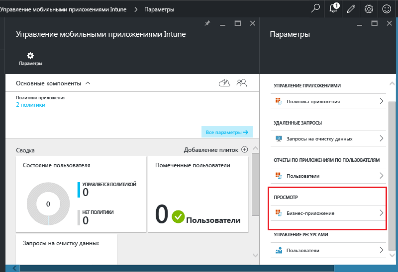
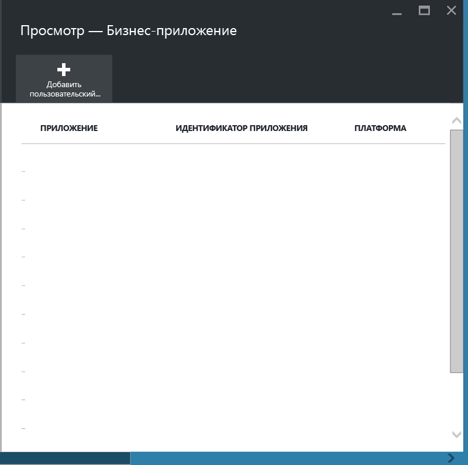
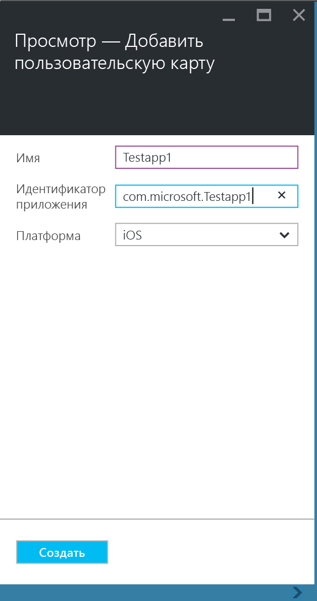
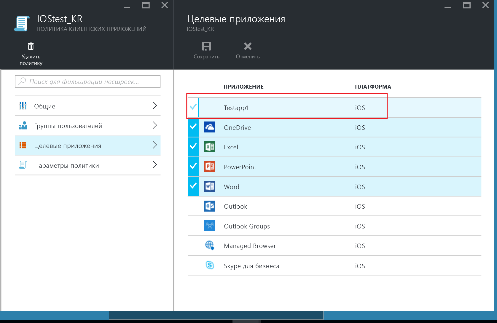
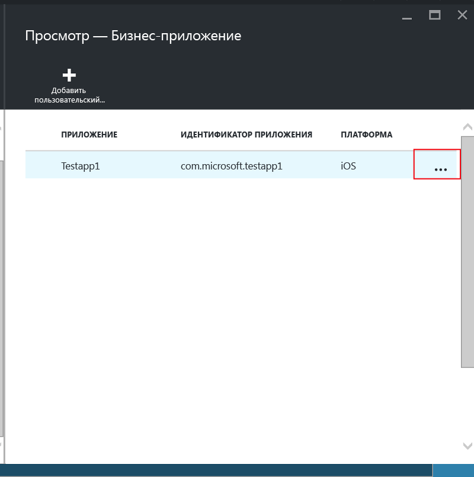

# Защита бизнес-приложений и данных на незарегистрированных устройствах

Политики управления мобильными приложениями (MAM) помогают защитить корпоративные данные, ограничивая перемещение данных, например копирование и вставку, а также предотвращая сохранение корпоративных документов в личных каталогах пользователей.   Чтобы применить политики MAM к бизнес-приложениям iOS и Android, нужно сначала упаковать приложения с помощью средства упаковки приложений Microsoft Intune.  В процессе упаковки к мобильному приложению добавляется уровень управления, при этом никаких изменений в самом приложении не происходит.  После упаковки приложения вы сможете применить к нему политики MAM и распространить его среди конечных пользователей.  

В этом разделе описаны действия для применения политик MAM к приложениям, находящимся на **устройствах сотрудников, которые не находятся под управлением**, и на устройствах, которые находятся под управлением **стороннего решения для управления мобильными устройствами (MDM)**.  Для подготовки бизнес-приложений на **устройствах, зарегистрированных в Intune**, обратитесь к разделу [Выбор способа подготовки приложений для управления мобильными приложениями с помощью Microsoft Intune](decide-how-to-prepare-apps-for-mobile-application-management-with-microsoft-intune.md).
##  Шаг 1. Подготовка приложения
Перед применением политик MAM к приложению сначала нужно упаковать приложение с помощью средства упаковки приложений Microsoft Intune.  Инструкции по установке и использованию средства упаковки приложений включены в пакет для скачивания.  
>[!IMPORTANT]  
>Эта версия средства упаковки приложений, которая поддерживает устройства, не зарегистрированные в Intune, доступна в рамках общедоступной предварительной версии. Если вы хотите участвовать в оценке общедоступной предварительной версии, вы можете скачать средство на [этой странице Github](https://github.com/msintuneappsdk/intune-app-wrapper-ios-preview) для iOS и [этом сайте](https://github.com/msintuneappsdk/intune-app-wrapper-android-preview) для Android.

## Шаг 2. Добавление приложения

Чтобы связать бизнес-приложения с политиками MAM, необходимо добавить сведения о приложении в подписку/клиента Intune, выполнив следующие действия:

1. На [портале Azure](https://portal.azure.com/) перейдите к разделу **Управление мобильными приложениями Intune > Настройки** и выберите **Бизнес-приложения**.

  

2. В колонке **Бизнес-приложения** выберите **Добавить настраиваемое приложение**.

  
3.  Укажите имя приложения, введите идентификатор пакета в поле "Идентификатор приложения" и выберите платформу (iOS или Android).

   Этот шаг помогает создать уникальный список для приложения.  Приложение будет также отображается в списке "Целевые приложения" для политики MAM клиента, как описано в следующем шаге.

## Шаг 3. Применение политик MAM
После отправки метаданных приложения в службу приложение появится в списке приложений.  Теперь можно [создать новую или выбрать существующую политику](create-and-deploy-mobile-app-management-policies-with-microsoft-intune.md) и применить ее к бизнес-приложениям, добавленным на шаге 2.

>[!IMPORTANT]
>Политику MAM необходимо нацелить на пользователей, которые будут использовать упакованное приложение.  Пользователи, для которых эта политика не развернута, не смогут использовать приложение.

  
## Шаг 4. Распространение приложения
Развернуть приложения для конечных пользователей можно следующими способами:
* Для устройств, зарегистрированных в решении MDM сторонних производителей, приложения можно распространять с помощью решения MDM.
* Для устройств, которые не находятся под управлением решения MDM, потребуется пользовательское решение. Конечные пользователи должны загрузить и установить приложение на своих устройствах.

## Изменение метаданных
Чтобы изменить сведения о приложении, такие как имя приложения или идентификатор пакета, необходимо [удалить приложение](#remove-apps) и [добавить его](#step-2-add-the-app) с новыми метаданными.

##  Удаление приложений
Бизнес-приложение можно удалить из списка приложений.  При этом приложение будет удалено из списка и будет удалена его связь с политиками MAM, но оно не будет удалено с устройства конечного пользователя.  

1.  На [портале Azure](https://portal.azure.com/) перейдите к разделу **Управление мобильными приложениями Intune > Настройки**.  В колонке **Настройки** выберите **Бизнес-приложения**, чтобы открыть список существующих приложений.  
2.  Выберите приложение, которое требуется удалить, и откройте контекстное меню **(...)**.

  
3.  Выберите **Удалить приложение** для удаления приложения.

  

  При этом приложение будет удалено из списка бизнес-приложений и целевого списка приложений политики MAM.

<!--HONumber=Sep16_HO2-->

