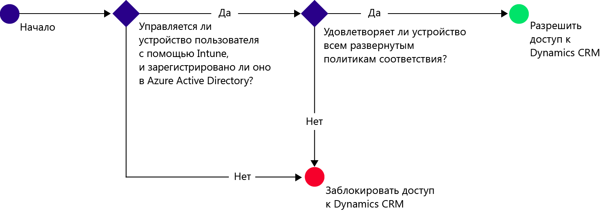
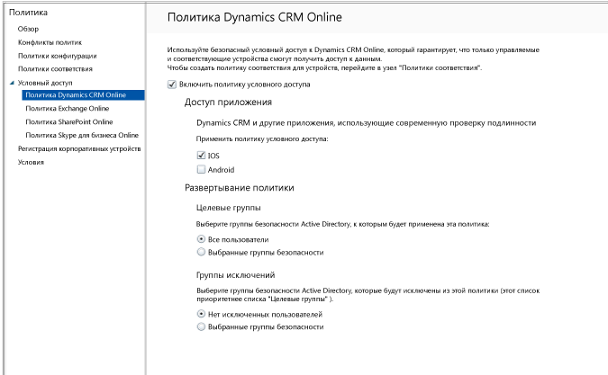

# Ограничение доступа электронной почты к Dynamics CRM Online с помощью Microsoft Intune
Доступом к Microsoft Dynamics CRM Online можно управлять из устройств iOS и Android с помощью условного доступа Microsoft Intune.  Условный доступ Intune включает два компонента:
* [Политика соответствия устройств](introduction-to-device-compliance-policies-in-microsoft-intune.md), которой устройства должны удовлетворять, чтобы считаться соответствующими.
* [Политика условного доступа](restrict-access-to-email-and-o365-services-with-microsoft-intune.md), где указываются условия, которым должно удовлетворять устройство для доступа к службе.

Дополнительные сведения о принципах работы условного доступа см. в статье [Ограничение доступа к электронной почте, Office 365 и другим службам](restrict-access-to-email-and-o365-services-with-microsoft-intune.md).

Когда целевой пользователь пытается использовать приложение Dynamics CRM на своем устройстве, выполняется следующая оценка:

Устройство, которому требуется доступ к Dynamics CRM Online, должно соответствовать следующим условиям:
* Устройство должно относиться к платформе **Android** или **iOS**.
* Устройство должно быть **зарегистрировано** в Windows Intune.
* Устройство должно **соответствовать** всем развернутым политикам соответствия Microsoft Intune .

Состояние устройства хранится в службе Azure Active Directory, которая предоставляет или блокирует доступ на основе указанных условий.

Если условие не выполняется, при входе пользователь получает следующие сообщения:
* Если устройство не зарегистрировано в Microsoft Intune либо в Azure Active Directory, выводится сообщение с инструкциями о том, как установить приложение корпоративного портала и выполнить регистрацию.
* Если устройство не соответствует требованиям, отображается сообщение, направляющее пользователя на веб-сайт корпоративного портала Microsoft Intune или к приложению корпоративного портала Intune, где можно найти сведения о данной проблеме и способах ее устранения.

## Настройка условного доступа для Dynamics CRM Online  
### Шаг 1. Настройка групп безопасности Active Directory

Прежде чем начать, настройте политику условного доступа в группах безопасности Azure Active Directory. Эти группы можно настроить в **Центре администрирования Office 365**. Они будут использоваться для назначения пользователей политике или исключения их из нее. Если на пользователя распространяется действие политики, каждое используемое им устройство должно соответствовать этой политике, чтобы он мог получить доступ к ресурсам.

Для политики Dynamics CRM Online можно указать два типа групп:
* **целевые группы** — группы пользователей, к которым применяется политика;
* **исключенные группы** — группы пользователей, которые исключены из политики.

Если пользователь входит в обе группы, то он будет исключен из политики.

### Шаг 2. Настройка и развертывание политики соответствия требованиям
[Создайте](create-a-device-compliance-policy-in-microsoft-intune.md) и [разверните](deploy-and-monitor-a-device-compliance-policy-in-microsoft-intune.md) политику соответствия для всех устройств, которые будет затрагивать эта политика. Это все устройства, которые используются пользователями в целевых группах.

> [!NOTE] Во время развертывания политик в группах Microsoft Intune политики условного доступа применяются к группам безопасности Azure Active Directory.

> [!IMPORTANT] Если политика соответствия требованиям не развернута, устройства считаются соответствующими.

Когда будете готовы, перейдите к шагу 3.
### Шаг 3. Настройка политики Dynamics CRM
Далее настройте в политике требование, разрешающее доступ к Dynamics CRM только для управляемых и соответствующих политикам устройств. Эта политика будет храниться в Azure Active Directory.

1.  В консоли администрирования Microsoft Intune выберите **Политика > Условный доступ > Политика Dynamics CRM Online**.

  

2.  Выберите политику **Включить условный доступ**.
3.  В разделе **Доступ приложения ** можно выбрать область применения политики условного доступа:
  * **iOS**
  * **Android**
4.  В разделе **Целевые группы** нажмите кнопку **Изменить**, чтобы выбрать группы безопасности Azure Active Directory, к которым будет применена политика. В качестве целевой аудитории можно выбрать всех пользователей или отдельные группы пользователей.
5.  Дополнительно в разделе **Исключенные группы** можно нажать кнопку **Изменить**, чтобы выбрать группы безопасности Azure Active Directory, которые будут исключены из этой политики.
6.  По завершении нажмите кнопку **Сохранить**.

Настройка условного доступа для Dynamics CRM выполнена. Развертывать политику условного доступа не нужно, она вступает в силу немедленно.
##  Мониторинг соответствия и политик условного доступа

В рабочей области **Группы** вы можете просмотреть состояние условного доступа своих устройств.

Выберите любую группу мобильных устройств, а затем на вкладке **Устройства** выберите один из следующих **фильтров**.
* **Устройства, не зарегистрированные в AAD** — для этих устройств доступ к Dynamics CRM заблокирован.
* **Не соответствующие политикам устройства** — для этих устройств доступ к Dynamics CRM заблокирован.
* **Устройства, зарегистрированные в AAD и соответствующие политикам** — эти устройства имеют доступ к Dynamics CRM.

##  Дальнейшие действия
[Ограничение доступа к Exchange Online](restrict-access-to-exchange-online-with-microsoft-intune.md)

[Ограничение доступа к Exchange в локальной среде](restrict-access-to-exchange-onpremises-with-microsoft-intune.md)
[Ограничение доступа к SharePoint Online](restrict-access-to-sharepoint-online-with-microsoft-intune.md)

[Ограничение доступа к Skype для бизнеса Online](restrict-access-to-skype-for-business-online-with-microsoft-intune.md)

<!--HONumber=Jun16_HO3-->

