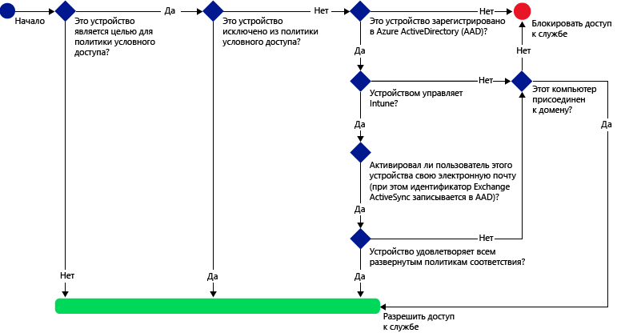
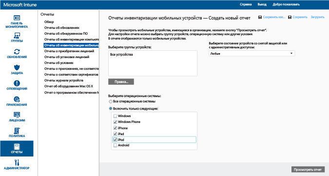
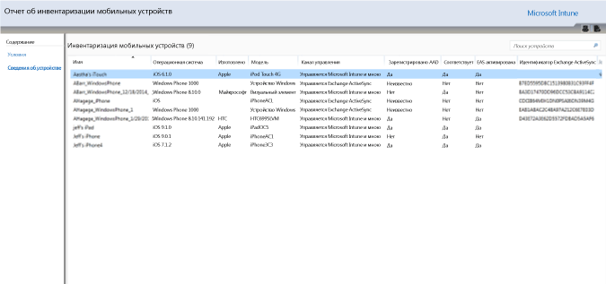
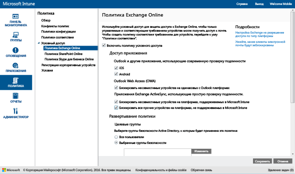
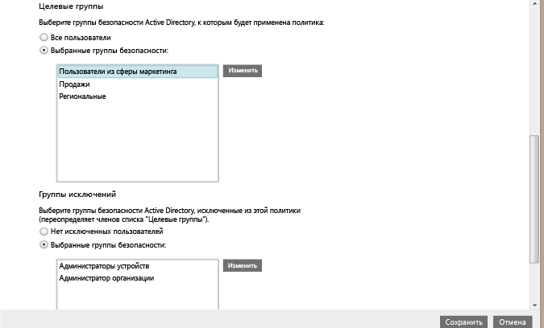
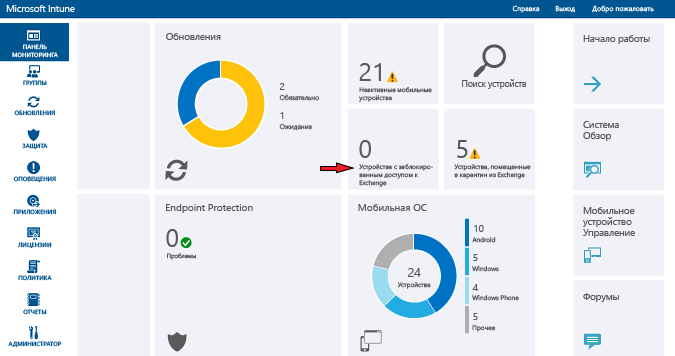

# Ограничение доступа к электронной почте в Exchange Online и новой выделенной среде Exchange Online с помощью Intune

Если для выделенной среды Exchange Online требуется определить, используется ли в ней новая или устаревшая конфигурация, обратитесь к менеджеру по работе с клиентами.

Для управления доступом к электронной почте в Exchange Online или новой выделенной среде Exchange Online настройте условный доступ для Exchange Online в Intune.
Дополнительные сведения о принципах работы условного доступа см. в статье [Ограничение доступа к электронной почте, Office 365 и другим службам](restrict-access-to-email-and-o365-services-with-microsoft-intune.md).

>[!IMPORTANT]
>Функция условного доступа для ПК и устройств на базе Windows 10 Mobile с приложениями, использующими современную проверку подлинности, сейчас доступна не всем клиентам Intune. Если вы уже используете эти функции, никаких дополнительных действий не требуется. Просто продолжайте пользоваться ими.

>Если вы еще не создали политики условного доступа для компьютеров или устройств Windows 10 Mobile с приложениями, использующими современную проверку подлинности, и хотите сделать это, зарегистрируйтесь для получения бесплатной пробной версии Azure Active Directory, в которую входит условный доступ на основе устройств для устройств, управляемых Intune, или компьютеров с Windows, присоединенных к домену. Дополнительные сведения см. в [этой записи блога](https://blogs.technet.microsoft.com/enterprisemobility/2016/08/10/azuread-conditional-access-policies-for-ios-android-and-windows-are-in-preview/).  

**Прежде чем** настроить условный доступ, необходимо выполнить следующие условия:

-   Необходимо использовать подписку **Office 365, включающую в себя Exchange Online (например, E3)**, а пользователи должны иметь лицензию на Exchange Online.

-  Рекомендуется настроить дополнительный соединитель служб **Microsoft Intune Service To Service Connector**, который подключает [!INCLUDE[wit_nextref](../includes/wit_nextref_md.md)] к Microsoft Exchange Online и позволяет управлять устройствами с помощью консоли [!INCLUDE[wit_nextref](../includes/wit_nextref_md.md)]. Соединитель не требуется для использования политик соответствия требованиям или политик условного доступа, но необходим для выполнения отчетов, которые помогут оценить влияние условного доступа.

   > [!NOTE]
   > Если планируется использовать условный доступ для Exchange Online и локальной среды Exchange, не следует настраивать соединитель служб.

   Инструкции по настройке соединителя см. в статье [Intune Service To Service Connector](intune-service-to-service-exchange-connector.md)

Если политики условного доступ настроены и ориентированы на пользователя, то для подключения к электронной почте его **устройство** должно удовлетворять следующим требованиям:

-   **Регистрация** в [!INCLUDE[wit_nextref](../includes/wit_nextref_md.md)] или на ПК, присоединенном к домену.

-  **Регистрация в Azure Active Directory**. Это происходит автоматически при регистрации устройства в [!INCLUDE[wit_nextref](../includes/wit_nextref_md.md)]. Кроме того, идентификатор клиента Exchange ActiveSync должен быть зарегистрирован в Azure Active Directory.

  Служба AAD DRS активируется автоматически для клиентов Intune и Office 365. Клиенты, которые уже развернули службу регистрации устройств ADFS, не будут видеть зарегистрированные устройства в своем локальном Active Directory.

-   Устройство должно **удовлетворять** любым развернутым на нем политикам соответствия [!INCLUDE[wit_nextref](../includes/wit_nextref_md.md)] или быть присоединенным к локальному домену.

Если политика условного доступа не соблюдается, при входе пользователь получает следующие сообщения:

- Если устройство не зарегистрировано в [!INCLUDE[wit_nextref](../includes/wit_nextref_md.md)] либо в Azure Active Directory, выводится сообщение с инструкциями о том, как установить приложение корпоративного портала, выполнить регистрацию и активировать электронную почту. Этот процесс также связывает идентификатор Exchange ActiveSync устройства с записью в Azure Active Directory.

-   Если устройство считается не соответствует правилам политики соответствия, конечный пользователь направляется на веб-сайт корпоративного портала [!INCLUDE[wit_nextref](../includes/wit_nextref_md.md)] или в приложение корпоративного портала, где можно найти сведения о данной проблеме и способах ее устранения.

На следующей схеме показан процесс, используемый политиками условного доступа для Exchange Online.

## Поддержка мобильных устройств
Доступ к электронной почте Exchange Online можно ограничить **Outlook** и другими **приложениями, использующими современную проверку подлинности**:

- Android 4.0 и более поздние версии, Samsung KNOX Standard 4.0 и более поздние версии
- iOS 7.1 и более поздние версии
- Windows Phone 8.1 и более поздней версии

**Современная проверка подлинности** активирует для клиентов Microsoft Office процедуру входа на основе библиотеки проверки подлинности Active Directory (ADAL).

-   Процедура проверки подлинности на основе ADAL позволяет клиентам Office применять проверку подлинности на основе браузера (также называемую пассивной проверкой подлинности).  Для проверки подлинности пользователь перенаправляется на веб-страницу входа в систему. Этот новый метод входа обеспечивает более высокий уровень безопасности за счет **многофакторной проверки подлинности** и **проверки подлинности на основе сертификатов**.
В этой [статье](https://support.office.com/en-US/article/How-modern-authentication-works-for-Office-2013-and-Office-2016-client-apps-e4c45989-4b1a-462e-a81b-2a13191cf517) содержатся более подробные сведения о современной проверке подлинности.
Настройте правила утверждений ADFS для блокирования несовременных протоколов проверки подлинности. Подробные инструкции представлены в сценарии 3 — [полная блокировка доступа к Office 365, за исключением браузерных приложений](https://technet.microsoft.com/library/dn592182.aspx).

Можно ограничить доступ к **Outlook Web Access (OWA)** на Exchange Online, если доступ осуществляется из браузера на устройствах под управлением **iOS** и **Android**.  Доступ будет разрешен только из поддерживаемых браузеров на соответствующих устройствах:

* Safari (iOS)
* Chrome (Android)
* Managed Browser (iOS и Android)

**Неподдерживаемые браузеры будут заблокированы**.

Приложения OWA для iOS и Android не поддерживаются.  Их следует блокировать с помощью правил утверждений ADFS.

Вы можете ограничить доступ к электронной почте Exchange с помощью встроенного **клиента электронной почты Exchange ActiveSync** на следующих платформах:

- Android 4.0 и более поздние версии, Samsung KNOX Standard 4.0 и более поздние версии

- iOS 7.1 и более поздние версии

- Windows Phone 8.1 и более поздней версии

## Поддержка для ПК

Условный доступ к **Exchange Online** и **SharePoint Online** можно настроить для компьютеров с настольными приложениями Office, которые отвечают следующим требованиям.

-   Компьютер должен работать под управлением Windows 7.0 или Windows 8.1.

-   Компьютер должен быть присоединен к домену или удовлетворять правилам политики соответствия.

    Чтобы считаться соответствующим, ПК должен быть зарегистрирован в [!INCLUDE[wit_nextref](../includes/wit_nextref_md.md)] и удовлетворять политикам.

    Для ПК, присоединенных к домену, необходимо настроить [автоматическую регистрацию устройства](https://azure.microsoft.com/documentation/articles/active-directory-conditional-access-automatic-device-registration/) в Azure Active Directory.
    >[!NOTE]
    >Условный доступ не поддерживается на компьютерах, где выполняется клиент Intune.

-   [Должна быть включена современная проверка подлинности Office 365](https://support.office.com/en-US/article/Using-Office-365-modern-authentication-with-Office-clients-776c0036-66fd-41cb-8928-5495c0f9168a), а также должны быть установлены все последние обновления Office.

    Современная проверка подлинности для клиентов Office 2013 под управлением Windows использует библиотеку проверки подлинности Active Directory (ADAL) и поддерживает более высокий уровень безопасности, обеспечиваемый **многофакторной проверкой подлинности** и **проверкой подлинности на основе сертификатов**.

-   Настройте правила утверждений ADFS для блокирования несовременных протоколов проверки подлинности. Подробные инструкции представлены в сценарии 3 — [полная блокировка доступа к Office 365, за исключением браузерных приложений](https://technet.microsoft.com/library/dn592182.aspx).

## Настройка условного доступа
### Шаг 1. Настройка и развертывание политики соответствия требованиям
Убедитесь, что [создана](create-a-device-compliance-policy-in-microsoft-intune.md) и [развернута](deploy-and-monitor-a-device-compliance-policy-in-microsoft-intune.md) политика соответствия для групп пользователей, к которым также будет применяться политика условного доступа.

> [!IMPORTANT]
> Если политика соответствия не развернута, устройства будут считаться соответствующими и получат доступ к Exchange.

### Шаг 2. Оценка влияния политики условного доступа
Чтобы найти устройства, для которых после настройки политики условного доступа может быть заблокирован доступ к Exchange, можно использовать **Отчеты инвентаризации мобильных устройств**

Для этого настройте подключение между [!INCLUDE[wit_nextref](../includes/wit_nextref_md.md)] и Exchange с помощью [соединителя служб Microsoft Intune](intune-service-to-service-exchange-connector.md).
1.  Выберите **Отчеты -> Отчеты об инвентаризации мобильных устройств**.

2.  В параметрах отчета выберите группу [!INCLUDE[wit_nextref](../includes/wit_nextref_md.md)], которую следует оценить и, при необходимости, платформы устройств, для которых будет действовать политика.
3.  После выбора условий, удовлетворяющих потребностям вашей организации, выберите **Просмотреть отчет**.
В новом окне открывается средство просмотра отчетов.

После запуска отчета изучите эти четыре столбца, чтобы определить, будет ли пользователь заблокирован:

-   **Канал управления** — указывает, управляется ли устройство Intune и/или Exchange ActiveSync.

-   **Зарегистрировано в AAD** — указывает, зарегистрировано ли устройство в Azure Active Directory (этот процесс называется присоединением к рабочей области).

-   **Соответствует** — указывает, соответствует ли устройство развернутым политикам соответствия.

-   **Идентификатор Exchange ActiveSync** — идентификатор Exchange ActiveSync устройств iOS и Android должен быть сопоставлен с записью регистрации устройства в Azure Active Directory. Это происходит, когда пользователь щелкает ссылку **Активировать электронную почту** в сообщении о карантине.

    > [!NOTE]
    > Устройства Windows Phone всегда отображают в этом столбце значение.

Устройствам, которые являются частью целевой группы, будет заблокирован доступ к Exchange, пока значения столбцов не будут совпадать со значениями, перечисленными в следующей таблице:

--------------------------
|Канал управления|Зарегистрировано в AAD|Соответствие|Идентификатор Exchange ActiveSync|Результирующее действие|
|----------------------|------------------|-------------|--------------------------|--------------------|
|**Управляется Microsoft Intune и Exchange ActiveSync**|Да|Да|Отображается значение|Доступ к электронной почте разрешен|
|Любое другое значение|Нет|Нет|Значение не отображается|Доступ к электронной почте заблокирован|
----------------------
Вы можете экспортировать содержимое отчета и использовать столбец **Адрес электронной почты** для информирования пользователей о том, что они будут заблокированы.

### Шаг 3. Настройка групп пользователей для политики условного доступа
Политики условного доступа нацелены на разные группы безопасности Azure Active Directory. Можно также исключить определенные группы пользователей из этой политики.  Когда пользователь становится целью для политики, каждое используемое им устройство должно быть совместимым, чтобы получить  доступ к электронной почте.

Эти группы можно настроить в **Центре администрирования Office 365**или на **портале учетных записей Intune**.

В каждой политике можно указать два типа групп:

-   **Целевые группы** — группы пользователей, к которым применяется данная политика.

-   **Исключенные группы** — группы пользователей, которые исключены из политики (необязательно).

Если пользователь входит в обе группы, то он будет исключен из политики.

Оценка производится только для тех групп, которые являются целевыми для политики условного доступа.

### Шаг 4. Настройка политики условного доступа

1.  В [консоли администрирования Microsoft Intune](https://manage.microsoft.com) выберите **Политика** > **Условный доступ** > **Политика Exchange Online**.

2.  На странице **Политика Exchange Online** выберите **Включить политику условного доступа для Exchange Online**.

    > [!NOTE]
    > Если политика соответствия не развернута, устройства считаются соответствующими.
    >
    > Независимо от состояния соответствия, все пользователи, на которых распространяется политика, должны будут регистрировать свои устройства в [!INCLUDE[wit_nextref](../includes/wit_nextref_md.md)].

3.  В разделе **Доступ приложения** выбрать платформы, к которым должна применяться политика, для приложений, использующих современную проверку подлинности, можно двумя способами. К поддерживаемым платформам относятся Android, iOS, Windows и Windows Phone.

    -   **Все платформы**

        Любое устройство, используемое для доступа к **Exchange Online**, должно быть зарегистрировано в Intune и удовлетворять заданным политикам.  Любое клиентское приложение, использующее **современную проверку подлинности**, регулируется политикой условного доступа, а если соответствующая платформа в настоящее время не поддерживается Intune, доступ к **Exchange Online** блокируется.

        Выбор варианта **Все платформы** означает, что Azure Active Directory будет применять эту политику ко всем запросам проверки подлинности независимо от платформы, о которой сообщает клиентское приложение.  Все платформы должны быть зарегистрированными и соответствующими со следующими исключениями.
        *   Устройства Windows должны быть зарегистрированными и соответствующими, присоединенными к домену с локальным каталогом Active Directory, либо для них могут выполняться оба условия.
        * Неподдерживаемые платформы, такие как Mac OS.  Однако приложения, использующие современные способы проверки подлинности, реализованные в этих платформах, будут блокироваться.

        >[!TIP]
           Этот параметр может не отображаться, если вы еще не используете условный доступ для ПК.  Используйте вместо него параметр **Определенные платформы**. Сейчас условный доступ для ПК доступен не для всех клиентов Intune.   Дополнительные сведения о том, как получить доступ к этой функции, см. [в этой записи блога](https://blogs.technet.microsoft.com/enterprisemobility/2016/08/10/azuread-conditional-access-policies-for-ios-android-and-windows-are-in-preview/).

    -   **Определенные платформы**

         Политика условного доступа применяется для любого клиентского приложения, использующего **современную проверку подлинности**, на выбранных вами платформах.

4. В разделе **Outlook web access (OWA)** можно разрешить доступ к Exchange Online только через поддерживаемые браузеры: Safari (iOS) и Chrome (Android). Доступ из других браузеров будет заблокирован. Здесь применяются те же ограничения платформы, которые были выбраны для доступа приложения для Outlook.

  На устройствах **Android** необходимо разрешить доступ браузера.  Для этого необходимо включить параметр "Включить доступ браузера" на зарегистрированном устройстве.
  1.    Запустите **приложение корпоративного портала**.
  2.    Перейдите на страницу **Настройки**, нажав кнопку с тремя точками (...) или аппаратную кнопку меню.
  3.    Нажмите кнопку **Включить доступ браузера**.
  4.    В браузере Chrome выйдите из Office 365 и перезагрузите Chrome.

  На платформах **iOS и Android**. Для идентификации устройства, используемого для доступа к службе, Azure Active Directory выдаст устройству сертификат безопасности TLS.  На устройстве этот сертификат отобразится вместе с запросом на выбор сертификата, как показано на снимках экрана ниже. Пользователь должен выбрать этот сертификат, прежде чем продолжить работу с браузером.

  **iOS**

  

  **Android**

  

5.  В разделе **Приложения Exchange ActiveSync** можно заблокировать доступ несоответствующих устройств к Exchange Online. Также можно разрешить или запретить доступ к электронной почте, когда устройство работает на неподдерживаемой платформе. К поддерживаемым платформам относятся Android, iOS, Windows и Windows Phone.

6.  В разделе **Целевые группы**выберите группы безопасности Active Directory пользователей, к которым будет применена политика. В качестве целевой аудитории можно выбрать всех пользователей или отдельные их группы.

    > [!NOTE]
    > Для пользователей, которые являются членами **целевых групп**, политики Intune заменят правила и политики Exchange.
    >
    > Exchange сможет разрешать, блокировать и помещать в карантин правила, а также политики Exchange только в том случае, если:
    >
    > -   пользователь не имеет лицензии на Intune;
    > -   у пользователя есть лицензия на Intune, но он не входит ни в одну из групп безопасности, на которые распространяется политика условного доступа.

6.  В разделе **Исключенные группы**выберите группы безопасности Active Directory пользователей, которые будут исключены из этой политики. Если пользователь входит в обе указанные группы, то он будет исключен из политики.

7.  По завершении нажмите кнопку **Сохранить**.

-   Развертывать политику условного доступа не нужно, она вступает в силу немедленно.

-   Устройство блокируется сразу, как только пользователь создает учетную запись электронной почты.

-   Если заблокированный пользователь регистрирует устройство в [!INCLUDE[wit_nextref](../includes/wit_nextref_md.md)] и устраняет несоответствие, доступ к электронной почте будет разблокирован в течение 2 минут.

-   Если пользователь отменяет регистрацию устройства, электронная почта будет заблокирована приблизительно через 6 часов.

**Примеры сценариев по настройке политики условного доступа для ограничения доступа к устройству см. в статье с [Примеры сценариев ограничения доступа к электронной почте](restrict-email-access-example-scenarios.md).**

## Мониторинг соответствия и политик условного доступа

#### Просмотр устройств, которым заблокирован доступ к Exchange

На панели мониторинга [!INCLUDE[wit_nextref](../includes/wit_nextref_md.md)] выберите элемент **Устройства с заблокированным доступом к Exchange**, чтобы показать количество заблокированных устройств и ссылки на дополнительные сведения.

## Дальнейшие действия
[Ограничение доступа к SharePoint Online](restrict-access-to-sharepoint-online-with-microsoft-intune.md)

[Ограничение доступа к Skype для бизнеса Online](restrict-access-to-skype-for-business-online-with-microsoft-intune.md)

<!--HONumber=Aug16_HO4-->

