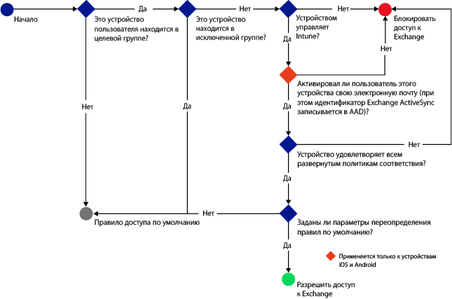
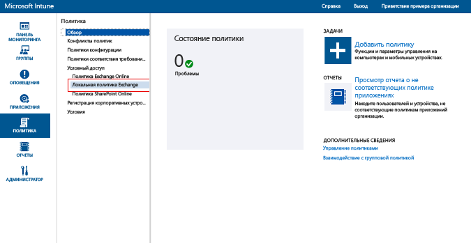
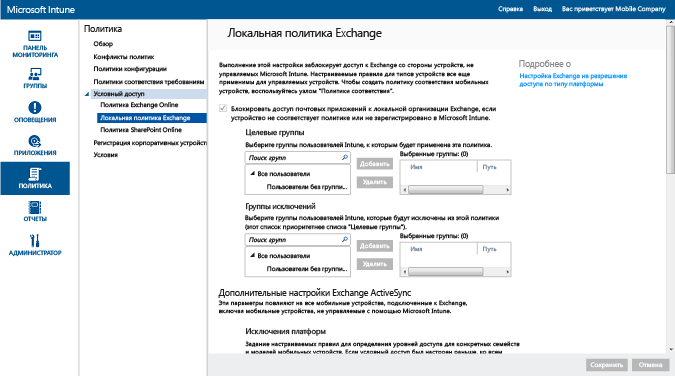

# Ограничение доступа к электронной почте в локальной организации Exchange и прежней выделенной среде Exchange Online с помощью Intune

Если для выделенной среды Exchange Online требуется определить, используется ли в ней новая или устаревшая конфигурация, обратитесь к менеджеру по работе с клиентами.

Для управления доступом к электронной почте в локальной организации Exchange или прежней выделенной среде Exchange Online настройте условный доступ к локальной организации Exchange в Intune.
Дополнительные сведения о принципах работы условного доступа см. в статье [Ограничение доступа к электронной почте и службам Office 365]( restrict-access-to-email-and-o365-services-with-microsoft-intune.md).

**Прежде чем** настроить условный доступ, необходимо выполнить следующие условия:

-   Следует использовать **Exchange 2010 или Exchange более поздней версии**. Массив сервера клиентского доступа (CAS) сервера Exchange Server поддерживается.

-   Необходимо использовать **локальный соединитель Exchange**, который подключает [!INCLUDE[wit_nextref](../includes/wit_nextref_md.md)] к локальной организации Microsoft Exchange. Это позволяет управлять устройствами с помощью консоли [!INCLUDE[wit_nextref](../includes/wit_nextref_md.md)]. Дополнительные сведения о соединителе см. в статье [Локальный соединитель Exchange в Intune](intune-on-premises-exchange-connector.md).

    -   Доступный в консоли Intune локальный соединитель Exchange привязан к вашему клиенту Intune и не может использоваться с любым другим клиентом. Также следует убедиться, что соединитель Exchange для вашего клиента устанавливается **только на одном компьютере**.

        Этот соединитель должен загружаться из консоли администрирования Intune.  Пошаговое руководство по настройке локального соединителя Exchange см. в статье [Настройка локального соединителя Exchange для локальной или размещенной службы Exchange](intune-on-premises-exchange-connector.md).

    -   Соединитель можно установить на любом компьютере при условии, что этот компьютер может взаимодействовать с сервером Exchange.

    -   Этот соединитель поддерживает **среду серверов клиентского доступа Exchange**. С технической точки зрения можно установить соединитель прямо на сервере клиентского доступа Exchange, но делать это не рекомендуется, так как увеличится нагрузка на сервер.
    Соединитель необходимо настроить так, чтобы он обменивался данными с одним из серверов клиентского доступа Exchange.

-   **Exchange ActiveSync** можно настроить с помощью проверки подлинности на основе сертификатов или записи учетных данных пользователя.

Если политики условного доступ настроены и ориентированы на пользователя, то для подключения к электронной почте его **устройство** должно удовлетворять следующим требованиям:

-  **Регистрация** в [!INCLUDE[wit_nextref](../includes/wit_nextref_md.md)] или ПК, присоединенный к домену.

-  **Регистрация в Azure Active Directory**. Кроме того, идентификатор клиента Exchange ActiveSync должен быть зарегистрирован в Azure Active Directory.

  Служба AAD DRS активируется автоматически для клиентов Intune и Office 365. Клиенты, которые уже развернули службу регистрации устройств ADFS, не будут видеть зарегистрированные устройства в своем локальном Active Directory. **Это не относится к ПК под управлением Windows и к устройствам Windows Phone**.

-   **Удовлетворение** любым развернутым на нем политикам соответствия [!INCLUDE[wit_nextref](../includes/wit_nextref_md.md)].

Следующая схема показывает процедуру, применяемую политиками условного доступа для локальной организации Exchange, чтобы предоставить или заблокировать доступ для устройств:

 Если политика условного доступа не соблюдается, то при входе в систему пользователь получает одно из следующих сообщений:

- Если устройство не зарегистрировано в [!INCLUDE[wit_nextref](../includes/wit_nextref_md.md)] либо в Azure Active Directory, выводится сообщение с инструкциями о том, как установить приложение корпоративного портала, выполнить регистрацию и активировать электронную почту. Этот процесс также связывает идентификатор Exchange ActiveSync устройства с записью в Azure Active Directory.

-   Если устройство не соответствует требованиям, отображается сообщение, направляющее пользователя на веб-сайт или в приложение корпоративного портала [!INCLUDE[wit_nextref](../includes/wit_nextref_md.md)], где можно найти сведения о данной проблеме и способах ее решения.

## Поддержка мобильных устройств
-   Windows Phone 8 и более поздней версии.

-   Собственное почтовое приложение в iOS

-   Собственное почтовое приложение в Android 4 или более поздней версии
> [!NOTE]
> Приложение Microsoft Outlook в iOS и Android не поддерживается.

## Поддержка для ПК

Приложение **Почта** в Windows 8 и более поздних версиях (при регистрации в [!INCLUDE[wit_nextref](../includes/wit_nextref_md.md)])

##  Настройка политики условного доступа

1.  В [консоли администрирования Microsoft Intune](https://manage.microsoft.com) выберите **Политика** > **Условный доступ** > **Локальная политика Exchange**.

2.  Настройте политику с необходимыми параметрами: 

  - **Блокировать доступ почтовых приложений к локальной организации Exchange, если устройство не соответствует политике или не зарегистрировано в Microsoft Intune:** при выборе этого параметра устройствам, которые не управляются с помощью [!INCLUDE[wit_nextref](../includes/wit_nextref_md.md)] или не удовлетворяют политике соответствия, будет заблокирован доступ к службам Exchange.

  - **Переопределение правила по умолчанию — всегда разрешать зарегистрированным и соответствующим требованиям устройствам получать доступ к Exchange:** если выбран этот параметр, устройства, зарегистрированные в Intune и соответствующие политикам, получают доступ к Exchange.  
  Это правило переопределяет **Правило по умолчанию**, то есть даже если вы настроите **Правило по умолчанию** на помещение в карантин или блокировку доступа, зарегистрированные и соответствующие требованиям устройства по-прежнему будут иметь доступ к Exchange.

  - **Целевые группы:** выберите группы пользователей [!INCLUDE[wit_nextref](../includes/wit_nextref_md.md)] , которые должны зарегистрировать устройство в [!INCLUDE[wit_nextref](../includes/wit_nextref_md.md)] для получения доступа к Exchange.

  - **Исключенные группы:** выберите группы пользователей [!INCLUDE[wit_nextref](../includes/wit_nextref_md.md)], которые исключаются из политики условного доступа Пользователи из этого списка будут исключены, даже если они также указаны в списке **Целевые группы**.

  - **Исключения платформы:** нажмите кнопку **Добавить правило**, чтобы настроить правило, определяющее уровни доступа для указанных семейств и моделей мобильных устройств. Так как эти устройства могут быть любого типа, то можно настроить те типы устройств, которые не поддерживаются в [!INCLUDE[wit_nextref](../includes/wit_nextref_md.md)].

  - **Правило по умолчанию:** для устройства, на которое не распространяются никакие другие правила, можно разрешить доступ к Exchange, заблокировать такой доступ или поместить устройство в карантин. Когда вы настраиваете правило, чтобы разрешить доступ для устройств, которые зарегистрированы и соответствуют требованиям, доступ к электронной почте для устройств Windows, iOS и Samsung KNOX предоставляется автоматически. Конечному пользователю не нужно проходить какую-либо процедуру, чтобы получить доступ к электронной почте.  На устройствах Android без Samsung KNOX конечные пользователи получают сообщение электронной почты о карантине с пошаговыми инструкциями по проверке регистрации и соответствия. Доступ к электронной почте пользователи могут получить, только выполнив эти инструкции. Если вы настроили правило на блокировку доступа или помещение в карантин, доступ к Exchange запрещается для всех устройств независимо от того, зарегистрированы ли они в Intune. Чтобы предотвратить применение этого правила к зарегистрированным и соответствующим устройствам, установите флажок **Default Rule Override** (Переопределение правила по умолчанию).
>[!TIP]
>Если вы хотите предварительно блокировать все устройства перед предоставлением доступа к электронной почте, выберите правило блокировки доступа или помещения в карантин. Правило по умолчанию будет применяться ко всем типам устройств, включая типы устройств, которые настраиваются в качестве исключений платформы и не поддерживаются [!INCLUDE[wit_nextref](../includes/wit_nextref_md.md)].

  - **Уведомление для пользователей:** кроме уведомления из Exchange, Intune отправляет сообщение электронной почты с описанием действий по разблокировке устройства. Исходное сообщение можно изменить в соответствии с актуальными потребностями. Так как уведомление Intune с инструкциями по исправлению доставляется в почтовый ящик Exchange пользователя в случае, если устройство пользователя блокируется, прежде чем он получит это сообщение, пользователь может использовать незаблокированное устройство или другой способ для доступа к Exchange и просмотра сообщения. Это особенно актуально, когда **Правило по умолчанию** настроено на блокировку доступа или помещение в карантин.  В этом случае конечному пользователю потребуется перейти в Магазин приложений, скачать приложение корпоративного портала Майкрософт и зарегистрировать свое устройство. Это применимо к устройствам Windows, iOS и Samsung KNOX.  Для устройств без Samsung KNOX вам потребуется отправить сообщение электронной почты о карантине на запасную учетную запись электронной почты, которое конечный пользователь должен затем скопировать на свое заблокированное устройство для завершения процесса регистрации и обеспечения соответствия.|
  > [!NOTE]
  > Чтобы система Exchange могла отправить уведомление по электронной почте, необходимо указать учетную запись, которая будет использоваться для отправки такого уведомления.
  >
  > Дополнительные сведения см. в статье [Настройка локального соединителя Exchange для локальной или размещенной службы Exchange](intune-on-premises-exchange-connector.md).

3.  По завершении нажмите кнопку **Сохранить**.

-   Развертывать политику условного доступа не нужно, она вступает в силу немедленно.

-   После того как пользователь настроит профиль Exchange ActiveSync, блокировка устройства может занять от 1 до 3 часов (если оно не находится под управлением [!INCLUDE[wit_nextref](../includes/wit_nextref_md.md)]).

-   Если заблокированный пользователь регистрирует устройство в [!INCLUDE[wit_nextref](../includes/wit_nextref_md.md)] (и устраняет несоответствие), доступ к электронной почте будет разблокирован в течение 2 минут.

-   Если пользователь отменяет регистрацию из [!INCLUDE[wit_nextref](../includes/wit_nextref_md.md)], блокировка устройства может занять от 1 до 3 часов.

**Примеры сценариев по настройке политики условного доступа для ограничения доступа к устройству см. в статье с [Примеры сценариев ограничения доступа к электронной почте](restrict-email-access-example-scenarios.md).**

## Дальнейшие действия
[Ограничение доступа к SharePoint Online](restrict-access-to-sharepoint-online-with-microsoft-intune.md)

[Ограничение доступа к Skype для бизнеса Online](restrict-access-to-skype-for-business-online-with-microsoft-intune.md)

<!--HONumber=Jun16_HO4-->

