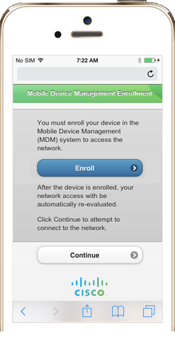

# Использование Cisco ISE с Microsoft Intune
Интеграция Intune с Cisco ISE позволяет создавать политики сети в среде ISE с помощью регистрации устройств и состояния соответствия Intune. Эти политики позволяют гарантировать, что доступ к сети организации будут иметь только устройства, управляемые Intune и соответствующие политикам Intune. 

## Конфигурация

Для использования такой интеграции не нужно настраивать клиент Intune. Потребуется предоставить серверу Cisco ISE разрешение на доступ к клиенту Intune, и после этого остальная настройка происходит на сервере Cisco ISE. В этой статье приводятся инструкции по предоставлению серверу ISE разрешений на доступ к клиенту Intune. 

### Шаг 1. Управление сертификатами
1. В консоли Azure Active Directory (AAD) экспортируйте сертификат. 

    #### Internet Explorer 11
        
    а. Запустите Internet Explorer от имени администратора и выполните вход в консоль AAD.
  
    b. Щелкните значок замка в адресной строке и выберите **Просмотр сертификатов**.
    
    в. На вкладке **Сведения** в свойствах сертификата выберите **Копировать в файл**.

    г. На странице **Добро пожаловать в мастер экспорта сертификатов** нажмите кнопку **Далее**. 

    д. На странице **Формат файла экспорта** оставьте значение по умолчанию **Двоичный стандарт X.509 с DER-шифрованием (CER)** и нажмите кнопку **Далее**.  

    е. На странице **Файл для экспорта** выберите **Обзор**, чтобы выбрать расположение для сохранения файла, и укажите имя файла. Может показаться, что вы выбираете файл для экспорта, однако на самом деле вы называете файл, в который будет сохранен экспортированный сертификат. Нажмите кнопку **Далее**&gt; **Готово**.

    #### Safari
    
    а. Войдите в консоль AAD.

    b. Щелкните значок замка &gt; **Дополнительные сведения**.
    
    в. Выберите **Просмотр сертификата** &gt; **Сведения**.

    г. Выберите сертификат, а затем выберите **Экспорт**.  

    > [!IMPORTANT]
    > Проверьте срок действия сертификата, поскольку по истечении срока действия этого сертификата потребуется экспортировать и импортировать новый.

    

2. В консоли ISE импортируйте сертификат Intune (экспортированный файл) в хранилище **Доверенных сертификатов**.
3. В консоли ISE выберите **Администрирования** > **Сертификаты** > **Системные сертификаты**.
4. Выберите сертификат ISE, а затем нажмите кнопку **Экспорт**.
5. В текстовом редакторе отредактируйте экспортированный сертификат.
 - Удалите строку ** -----BEGIN CERTIFICATE-----**.
 - Удалите строку ** -----END CERTIFICATE-----**.
 - Убедитесь, что весь текст представляет собой одну строку.

### Шаг 2. Создание приложения для ISE на клиенте AAD
1. В консоли Azure Active Directory (AAD) выберите **Приложения** > **Добавить приложение** > **Добавить приложение, разрабатываемое моей организацией**.
2. Укажите имя и URL-адрес для приложения. URL-адрес может быть веб-сайтом вашей компании.
3. Загрузите манифест приложения (файл JSON).
4. Измените файл манифеста JSON. В качестве значения параметра **keyCredentials** укажите измененный текст сертификата из шага 1.
5. Сохраните файл, не меняя его названия.
6. Предоставьте своему приложению разрешения на API-интерфейс Microsoft Graph и Microsoft Intune.
    1. Для Microsoft Graph выберите следующие параметры.
        - **Разрешения приложения**: чтение данных каталога.
        - **Делегированные разрешения**: 
            - доступ к данным пользователя в любое время.
          - Вход пользователей
   2. Для API-интерфейса Microsoft Intune в меню **Разрешения приложения** выберите **Получить состояние устройства и соответствия из Intune**.

7. Выберите **Просмотр конечных точек** и скопируйте следующие значения для использования при настройке параметров ISE:

|Значение на портале AAD|Соответствующее поле на портале ISE|
|-------------------|---------------------------------|
|Конечная точка Microsoft Azure AD Graph API|URL-адрес автоматического обнаружения|
|Конечная точка маркера OAuth 2.0|URL-адрес издания маркера|
|Добавьте в ваш код ИД клиента|Идентификатор клиента|

### Шаг 3. Настройка параметров ISE 
2. В консоли администрирования ISE задайте следующие значения параметров. 
  - **Тип сервера**: Mobile Device Manager.
  - **Тип проверки подлинности**: OAuth, учетные данные клиента.
  - **Автоматическое обнаружение**: да.
  - **URL-адрес автоматического обнаружения**: введите значение из шага 1.
  - **Идентификатор клиента**: введите значение из шага 1.
  - **URL-адрес издания маркера**: введите значение из шага 1.

## Данные, которыми обмениваются клиент Intune и сервер Cisco ISE
В следующей таблице приведены данные, которыми обмениваются клиент Intune и сервер Cisco ISE для устройств, управляемых Intune.

|Свойство|  Описание|
|---------------|------------------------------------------------------------|
|complianceState|   True или false (строка) указывает, соответствует ли устройство условиям.|
|IsManaged| True или false (указывает, управляется ли клиент с помощью Intune).|
|macAddress|MAC-адрес устройства.|
|серийный номер|Серийный номер устройства. Применяется только к устройствам iOS.|
|imei|IMEI (15-разрядное число: 14 цифр и одна контрольная цифра) или IMEISV (16 разрядов) содержит сведения о происхождении, модели и серийном номере устройства. Структура IMEI и IMEISV определяется в стандарте 3GPP TS 23.003. Применяется только к устройствам с SIM-картами.)|
|udid|Уникальный идентификатор устройства, последовательность из 40 букв и цифр для устройств iOS.|
|meid|Идентификатор мобильного оборудования, глобальный уникальный номер, определяющий физическое мобильное устройство CDMA. Формат номера определяется в стандарте 3GPP2 report S. R0048, но по существу его можно считать номером IMEI, который состоит из шестнадцатеричных цифр. Номер MEID является 56-разрядным числом (14 шестнадцатеричных цифр). Он состоит из трех полей, включая 8-разрядный код региона (RR), 24-разрядный код производителя и присвоенный производителем 24-разрядный серийный номер.| 
|osVersion| Версия операционной системы устройства.
|для базы данных модели|Модель устройства.
|manufacturer|Изготовитель устройства.
|azureDeviceId| Идентификатор устройства после его присоединения к Azure Active Directory. Для неприсоединенных устройств это пустой идентификатор GUID.|
|lastContactTimeUtc|Дата и время, когда устройство последний раз регистрировалось в службе управления Intune. 

## Взаимодействие с пользователем

Когда пользователь пытается получить доступ к ресурсам с помощью незарегистрированного устройства, он получит приглашение для регистрации, как показано ниже.

Если пользователь выберет регистрацию, он будет перенаправлен в процесс регистрации Intune. Процедура регистрации пользователей для Intune описана в следующих разделах:

- [Регистрация устройства Android в Intune](/intune/enduser/enroll-your-device-in-Intune-android) 
- [Регистрация устройства iOS в Intune](/intune/enduser/enroll-your-device-in-intune-ios) 
- [Регистрация устройства Mac OS X в Intune](/intune/enduser/enroll-your-device-in-intune-mac-os-x) 
- [Регистрация устройства Windows в Intune](/intune/enduser/enroll-your-device-in-intune-windows)  

Также можно [загрузить набор инструкций по регистрации](https://gallery.technet.microsoft.com/End-user-Intune-enrollment-55dfd64a), с помощью которых можно составить свое собственное руководство для пользователей.

### См. также

[Руководство администратора по Cisco Identity Services Engine, выпуск 2.1](http://www.cisco.com/c/en/us/td/docs/security/ise/2-1/admin_guide/b_ise_admin_guide_21/b_ise_admin_guide_20_chapter_01000.html#task_820C9C2A1A6647E995CA5AAB01E1CDEF)

<!--HONumber=Jul16_HO3-->

