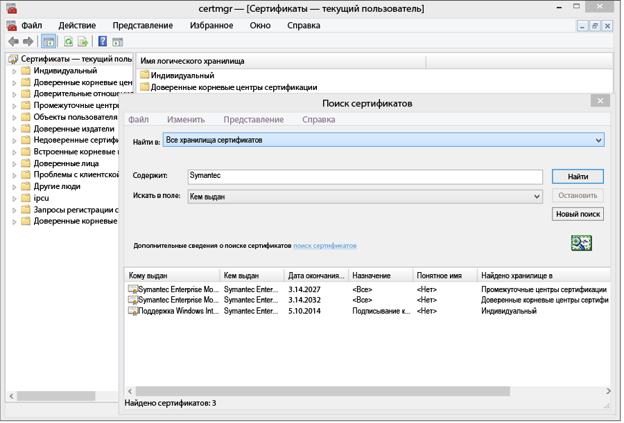
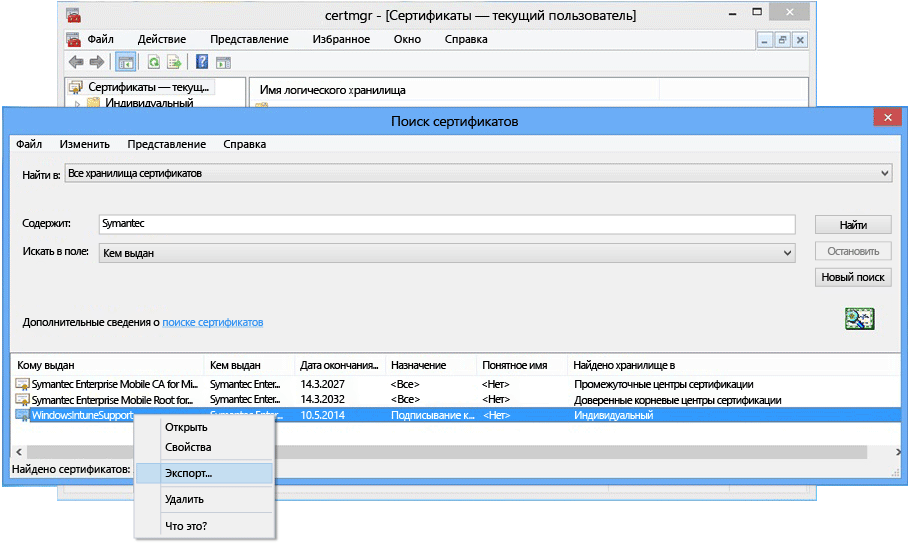

# Настройка управления устройствами для Windows Phone 8.0

В Windows Phone 8.0 для установки приложения корпоративного портала Intune и разрешения управления устройствами необходим сертификат Symantec. Кроме того, сертификат требуется для подписи бизнес-приложений. Следующий раздел предназначен только для Windows Phone 8.0. Для управления Windows Phone 8.1 или более поздней версии, в том числе Windows 10 Mobile, обратитесь к разделу [Настройка регистрации Windows Phone](set-up-windows-phone-management-with-microsoft-intune.md).

> [!IMPORTANT]
> Начиная с сентября 2016 года приложение "Корпоративный портал" для Windows 8.0 и Windows Phone 8.0 будет недоступно для скачивания.

-   **Windows Phone 8** — требуется сертификат
-   **Windows Phone 8.1 и Windows 10 Mobile** нуждаются в сертификате только в следующих ситуациях:

    -   Вы хотите развернуть приложение корпоративного портала.

    -   Вы развернете бизнес-приложения (загрузите неопубликованные приложения).


  > [!IMPORTANT]
  > Сертификат Symantec, используемый для управления определенными мобильными устройствами Windows и Windows Phone, [должен периодически обновляться](renew-a-symantec-code-signing-certificate.md).

Требования к установке для управления мобильными устройствами Windows Phone зависят от способа управления устройствами.  Настройка двух записей CNAME в регистрации DNS упрощает использование соглашения о регистрации. Если пользователи скачают приложение портала компании из Магазина, то после настройки параметров DNS вам потребуется только настроить портал компании и уведомить пользователей о способе регистрации.  Для Windows Phone 8.0 или Windows Phone 8.1, где будет развернут корпоративный портал, потребуется сертификат Symantec для подписания кода приложения.

## Настройка требования к установке для реализации управления Windows Phone
1.  **Настройка Intune**. Если это еще не сделано, подготовьтесь к управлению мобильными устройствами, [задав в качестве центра управления мобильными устройствами](prerequisites-for-enrollment.md#set-mobile-device-management-authority) службу **Microsoft Intune** и настроив MDM.

2.  **Задать DNS-псевдоним для адреса сервера регистрации** (необязательно)

    С помощью DNS-псевдонимов (тип записи CNAME) пользователи без труда могут регистрировать свои устройства, автоматически заполняя имя сервера во время регистрации.

    1.  В [консоли администрирования Intune](http://manage.microsoft.com) щелкните **Администрирование** &gt; **Управление мобильными устройствами** &gt; **Windows Phone**.

    2.  Введите URL-адрес проверенного домена веб-сайта организации в поле **Укажите проверенное имя домена** и нажмите кнопку **Проверить автообнаружение**.

    3.  Создайте запись ресурсов **CNAME** DNS для домена вашей организации. Записи ресурсов CNAME должны содержать следующие сведения:

        |Имя компьютера|Указывает на|TTL|
        |-------------|-------------|-------|
        |enterpriseenrollment.company_domain.com|enterpriseenrollment-s.manage.microsoft.com |1 час|
        |enterpriseregistration.company_domain.com|enterpriseregistration.windows.net|1 час|
        Например, если компания имеет веб-сайт contoso.com, необходимо создать запись CNAME в DNS, которая выполняет перенаправление с EnterpriseEnrollment.contoso.com на manage.microsoft.com. Если имеется несколько проверенных доменов, создайте запись CNAME для каждого из них.

        -   `enterpriseenrollment-s.manage.microsoft.com` — поддерживает перенаправление в службу Intune с распознаванием домена по имени домена электронной почты.

        -   `enterpriseregistration.windows.net` — поддерживает присоединение к рабочей области для мобильных устройств. Он также поддерживает условный доступ для Windows 8.1.

    

3.  **Управление сертификатами для поддержки подписи приложений** [Требуется для устройств Windows Phone 8.0 и Windows Phone 8.1, которые не обращаются к магазину Windows Phone и/или которым не нужны бизнес-приложения.]

    Для поддержки приложения портала компании для Windows Phone 8.0 и развертывания корпоративных приложений в Windows Phone 8.1 необходимо получить **корпоративный сертификат подписи кода мобильных устройств Symantec**. Нельзя использовать сертификат, выданный вашим собственным центром сертификации, поскольку только сертификат Symantec является доверенным для устройств Windows Phone. Этот сертификат необходим для выполнения следующих задач:

    -   подписывание приложения корпоративного портала для развертывания в [!INCLUDE[winphone8_client_1](../includes/winphone8_client_1_md.md)] для регистрации и управления телефоном;

    -   подписывание бизнес-приложений компании, чтобы система [!INCLUDE[wit_nextref](../includes/wit_nextref_md.md)] могла развернуть их на Windows Phone.

    Ниже приводятся процедуры получения необходимых сертификатов и подписания приложения корпоративного портала. Вам потребуется учетная запись центра разработки для Windows Phone, а затем необходимо будет приобрести сертификат Symantec.

    1.  **Присоединение к Центру разработки для Windows Phone** Присоединитесь к [Центру разработки для Windows Phone](http://go.microsoft.com/fwlink/?LinkId=268442) для приобретения корпоративной учетной записи, используя для входа сведения корпоративной учетной записи. Запрос должен быть утвержден должностным лицом организации, прежде чем вы сможете получить сертификат подписи кода.

    2.  **Получение сертификата Symantec для организации** Приобретите сертификат на [веб-сайте Symantec](http://go.microsoft.com/fwlink/?LinkId=268441), используя свой идентификатор Symantec. После покупки сертификата утверждающая организация, назначенная вами в учетной записи центра разработчиков Windows Phone, получит сообщение электронной почты с просьбой утвердить запрос сертификата. Дополнительные сведения о требованиях к сертификату Symantec см. в разделе [Почему для управления Windows Phone требуется сертификат Symantec?](https://technet.microsoft.com/en-us/library/dn764959.aspx#BKMK_Symantec). Регистрация устройств Windows. Часто задаваемые вопросы.

    3.  **Импорт сертификатов** После утверждения запроса вы получите электронное письмо с инструкциями по импорту сертификатов. Следуйте инструкциям в сообщении, чтобы импортировать сертификаты.

    4.  **Проверка импортированных сертификатов** Чтобы проверить импортированные сертификаты, перейдите в оснастку **Сертификаты**, щелкните правой кнопкой мыши узел **Сертификаты** и выберите пункт **Поиск сертификатов**. В поле **Содержит** введите Symantec и нажмите кнопку **Найти**. Импортированные сертификаты должны появиться в списке результатов.

        

    5.  **Экспорт сертификата подписи**. Убедившись в наличии сертификатов, можно экспортировать PFX-файл для подписывания корпоративного портала. Выберите сертификат Symantec с **целью выдачи** "подписывание кода". Щелкните сертификат подписи кода правой кнопкой мыши и выберите пункт **Экспортировать**.

        

        В окне **Мастер экспорта сертификатов**установите переключатель **Да, экспортировать закрытый ключ** и нажмите кнопку **Далее**. **Выберите файл обмена личной информацией –PKCS #12 (PFX)** и установите флажок **По возможности включать все сертификаты в путь сертификации**. Завершите работу мастера. Дополнительные сведения см. в статье [Экспорт сертификата с закрытым ключом](http://go.microsoft.com/fwlink/?LinkID=203031).

    6.  **Скачивание и подпись приложения портала компании**

        Для поддержки регистрации Windows Phone необходимо, чтобы приложение корпоративного портала Windows Phone 8.0 было подписано и отправлено в Intune.

        1.  **Скачивание корпоративного портала** Скачайте [корпоративный Intune для Windows Phone](http://go.microsoft.com/fwlink/?LinkId=268440) из Центра загрузки. Расположение установки по умолчанию — `C:\Program Files (x86)\Microsoft Corporation\Windows Intune Company Portal for Windows Phone`.

        2.  **Скачивание пакета SDK для Windows 8.0** Скачайте [пакет SDK для Windows Phone](http://go.microsoft.com/fwlink/?LinkId=615570).

        3.  **Подпись кода приложения корпоративного портала**. С помощью приложения XAPSignTool, скачанного в составе пакета SDK, подпишите корпоративный портал, используя PFX-файл, созданный на основе сертификата Symantec. Дополнительные сведения см. в статье [How to sign a company app by using XapSignTool (Подписывание приложения компании с помощью XapSignTool)](http://go.microsoft.com/fwlink/?LinkID=280195).

    7.  **Отправка приложения корпоративного портала в Intune** Отправьте подписанный файл приложения корпоративного портала и сертификат подписывания кода, чтобы предоставить приложение конечным пользователям.

        1.  В [консоли администрирования Intune](http://manage.microsoft.com) щелкните **Администрирование** &gt; **Windows Phone**.

        2.  Щелкните **Отправить подписанный файл приложения** и выполните вход с помощью вашего ИД администратора Intune.

        3.  На странице **Установка программного обеспечения** в поле **Укажите расположение файлов установки ПО** откройте папку приложения корпоративного портала с подписыванием кода (XAP для Windows Phone 8.0 или APPX для Windows Phone 8.1).

            При оценке Intune и передаче файла приложения с подписыванием кода в пробной учетной записи Intune снимите флажок **Использовать файл приложения корпоративного портала, подписанного образцом сертификата подписи кода Symantec**.

        4.  Добавьте файл сертификата (PFX), экспортированный в **Сертификат подписывания кода**, и создайте пароль для сертификата.

        5.  Заполните поля на странице **Описание программного обеспечения** . Обратите внимание, что пользователи увидят эти сведения на устройствах при просмотре сведений о приложении на портале компании.

        6.  Завершите работу мастера. Пользователи, зарегистрировавшие устройство Windows Phone 8.0, смогут получить приложение портала компании на своих устройствах во время регистрации. Пользователи Windows Phone 8.1 могут установить приложение портала компании из Магазина.  Если устройства Windows Phone 8.1 заблокированы в Магазине Windows Phone или требуется развернуть приложение портала компании с помощью Intune, необходимо скачать и подписать приложение портала компании Windows Phone 8.1 (SSP.appx).

4.  **Сообщите пользователям о том, как они могут получить доступ к корпоративным ресурсам на корпоративном портале** Вашим пользователям потребуется узнать, как зарегистрировать устройства и чего ожидать после того, как они начнут управлять ими. [Что нужно сообщить конечным пользователям об использовании Microsoft Intune](what-to-tell-your-end-users-about-using-microsoft-intune.md)

## Развертывание приложения портала компании Windows Phone 8.1
Вы можете развернуть приложение корпоративного портала на устройствах Windows Phone 8.1 с помощью Intune вместо того, чтобы устанавливать его из Магазина Windows Phone. Необходимо по-прежнему разрешить регистрацию устройств с помощью шагов выше, с использованием сертификата Symantec. Затем потребуется скачать приложение портала компании Windows Phone 8.1 и подписать его с помощью сертификата Symantec.  Это необходимо сделать, только если пользователи не будут использовать Магазин компании и если вы хотите развернуть портал компании на устройствах Windows Phone 8.1.


1.  **Скачивание портала компании**

    Скачайте [приложение корпоративного портала Microsoft Intune для Windows Phone 8.1](http://go.microsoft.com/fwlink/?LinkId=615799) из Центра загрузки и запустите самоизвлекающийся файл (EXE). Этот файл содержит два файла:

    -   CompanyPortal.appx — приложение установки портала компании для Windows Phone 8.1;

    -   WinPhoneCompanyPortal.ps1 — скрипт PowerShell, который можно использовать для подписи файла для приложения портала компании, чтобы его можно было развернуть на устройствах Windows Phone 8.1.

2.  **Скачивание пакета SDK для Windows Phone** Скачайте [пакет SDK для Windows Phone версии 8.0](http://go.microsoft.com/fwlink/?LinkId=615570) (http://go.microsoft.com/fwlink/?LinkId=268439) и установите его на компьютере. Этот пакет SDK необходим для создания токена регистрации приложения.

3.  **Создание AETX-файла** Создайте файл токена регистрации приложения (AETX) из PFX-файла Symantec с помощью программы AETGenerator.exe, входящей в состав пакета SDK для Windows Phone версии 8.0. Инструкции по созданию AETX-файла см. в разделе [Создание токена регистрации приложения для Windows Phone](https://msdn.microsoft.com/library/windows/apps/jj735576.aspx).

4.  **Скачивание пакета SDK для Windows 8.1** Скачайте и установите [пакет SDK для Windows Phone](http://go.microsoft.com/fwlink/?LinkId=613525) (http://go.microsoft.com/fwlink/?LinkId=613525). Обратите внимание, что скрипт PowerShell, входящий в состав приложения портала компании, использует расположение установки по умолчанию — `${env:ProgramFiles(x86)}\Windows Kits\8.1`. Если установка производится в другое расположение, необходимо включить его в параметр командлета.

5.  **Подписание кода приложения с помощью PowerShell** С правами администратора откройте **Windows PowerShell** на главном компьютере с пакетом SDK для Windows, затем корпоративный сертификат подписи кода мобильных устройств Symantec, перейдите к файлу Sign-WinPhoneCompanyPortal.ps1 и запустите скрипт.

    **Пример 1**

    ```
    .\Sign-WinPhoneCompanyPortal.ps1 -InputAppx 'C:\temp\CompanyPortal.appx' -OutputAppx 'C:\temp\CompanyPortalEnterpriseSigned.appx' -PfxFilePath 'C:\signing\cert.pfx' -PfxPassword '1234' -AetxPath 'C:\signing\cert.aetx'
    ```
    В этом примере подписывается файл CompanyPortal.appx в C:\temp\ и создается файл CompanyPortalEnterpriseSigned.appx. Он будет использовать пароль PFX 1234 и считывать идентификатор издателя из PFX-файла. Он также считывает идентификатор организации из файла cert.aetx.

    **Пример 2**

    ```
    .\Sign-WinPhoneCompanyPortal.ps1 -InputAppx 'C:\temp\CompanyPortal.appx' -OutputAppx 'C:\temp\CompanyPortalEnterpriseSigned.appx' -PfxFilePath 'C:\signing\cert.pfx' -PfxPassword '1234' -PublisherId 'OID.0.9.2342.19200300.100.1.1=1000000001, CN="Test, Inc.", OU=Test 1' -EnterpriseId 1000000001
    ```
    В этом примере подписывается файл CompanyPortal.appx в C:\temp\ и создается файл CompanyPortalEnterpriseSigned.appx. Он будет использовать пароль PFX 1234 и указанный идентификатор издателя.

    **Параметры:**

    -   `-InputAppx` — локальный путь к файлу CompanyPortal.appx в одинарных кавычках. Например, 'C:\temp\CompanyPortal.appx'.

    -   `-OutputAppx` — локальный путь и имя файла для подписанного приложения корпоративного портала в одинарных кавычках. Например, 'C:\temp\CompanyPortalEnterpriseSigned.appx'.

    -   `-PfxFilePath` — локальный путь и имя экспортированного PFX-файла сертификата Symantec. Например, 'C:\signing\cert.pfx'.

    -   `-PfxPassword` — пароль, используемый для подписания PFX-файла, в одинарных кавычках. Например, '1234'.

    -   `-AetxPath` — локальный путь к AETX-файлу, который используется для считывания идентификатора организации, если аргумент EnterpriseId не задан. Необходимо указать либо этот аргумент, либо EnterpriseId. Например, 'C:\signing\cert.aetx'.

    -   `-PublisherId` — идентификатор издателя организации. Если он отсутствует, используется поле Subject (Тема) корпоративного сертификата подписи кода для мобильных устройств Symantec. Например, 'OID.0.9.2342.19200300.100.1.1=1000000001, CN="Test, Inc.", OU=Test 1'.

    -   `-SdkPath` — путь к корневой папке Windows SDK для Windows 8.1. Этот аргумент является необязательным и по умолчанию имеет значение ${env:ProgramFiles(x86)}\Windows Kits\8.1.

    -   `-EnterpriseId` — идентификатор организации. Необходимо указать либо этот аргумент, либо AetxPath. Если этот аргумент не задан, идентификатор организации считывается из AETX-файла. Например, 1000000001.

6.  Разверните приложение портала компании Windows Phone 8.1 (SSP.appx).

    > [!IMPORTANT]
    > Файл ssp.xap и портал компании из магазина можно установить одновременно, что может внести путаницу. Чтобы все пользователи использовали файл ssp.xap, создайте заблокированное приложение для версии портала компании из магазина. Существует три варианта, при которых все устройства Windows Phone 8.1 будут использовать только версию портала компании из магазина.
    >
    > -   Если загружать неопубликованные приложения не нужно и поддержка Windows Phone 8.0 не требуется, не отправляйте подписанный файл ssp.xap.
    > -   Если загрузка неопубликованных приложений необходима, но регистрирующиеся устройства Windows Phone 8 отсутствуют, измените состояние автоматически созданного развертывания файла ssp.xap с "доступно" на "удалить".
    > -   Если загруженные неопубликованные приложения необходимо установить и требуется регистрация устройств Windows Phone 8.0 и получение файла ssp.xap, создайте новое развертывание программного обеспечения для файла ssp.xap и разверните его с помощью действия **удалить** . Устройства Windows Phone 8.0 не поддерживают принудительную установку или удаление приложений, поэтому развертывание будет пропущено. Устройства Windows Phone 8.1 поддерживают действие удаления, и файл ssp.xap будет удален.


<!--HONumber=Sep16_HO4-->


