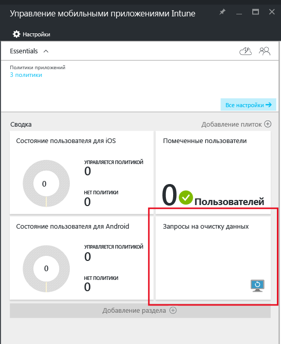
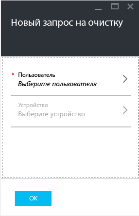
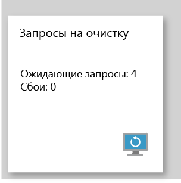

---
# required metadata

title: Очистка данных управляемых приложений организации с помощью Microsoft Intune | Microsoft Intune
description:
keywords:
author: karthikaraman
manager: jeffgilb
ms.date: 04/28/2016
ms.topic: article
ms.prod:
ms.service: microsoft-intune
ms.technology:
ms.assetid: 2742e1d5-d2d5-42cd-b719-665dd6e0a0e9

# optional metadata

#ROBOTS:
#audience:
#ms.devlang:
ms.reviewer: joglocke
ms.suite: ems
#ms.tgt_pltfrm:
#ms.custom:

---

# Очистка данных управляемых приложений компании с помощью Microsoft Intune
В случае потери или кражи устройства либо увольнения сотрудника необходимо убедиться, что данные приложений организации удалены с устройства. Однако может потребоваться не затронуть при этом личные данные, особенно в случае, если это устройство принадлежит сотруднику.

Чтобы выборочно удалить данные приложений организации, создайте запрос на очистку, выполнив действия из раздела **Создание запроса на очистку** этой статьи.  При следующем запуске приложения на устройстве после выполнения запроса на очистку осуществляется удаление данных организации из приложения.
>[!NOTE]
> Контакты, синхронизированные напрямую из приложения в собственную адресную книгу, удаляются. Все контакты, синхронизированные из собственной адресной книги в другой внешний источник, нельзя очистить. В настоящее время это распространяется только на приложение Microsoft Outlook.

## Создание запроса на очистку

1.  В колонке **Управление мобильными приложениями Intune** выберите плитку **Запросы на очистку данных**.

    

2.  Выберите **Новый запрос на очистку**.

    

3.  В колонке **Новый запрос на очистку** выберите **Пользователь**, чтобы открыть колонку **Пользователь**, и выберите пользователя, для которого нужно очистить данные приложения.

4.  Выберите **Устройство**.  Открывается колонка **Устройство** , где перечислены все устройства, связанные с выбранным пользователем.  Выберите устройство, которое хотите очистить.

5.  Теперь вы снова находитесь в колонке **Новый запрос на очистку**. Нажмите кнопку **ОК** для выполнения запроса на очистку. Служба создает и отслеживает отдельный запрос на очистку для каждого защищенного приложения на устройстве.

## Мониторинг запросов на очистку
В колонке **Intune mobile application management** (Управление мобильными приложениями Intune) на плитке **Wipe requests** (Запросы на очистку) приведен сводный отчет.  Он отображает общее состояние, а также количество ожидающих запросов и ошибок. Дополнительные сведения можно получить, выполнив описанные ниже действия:

1.  В колонке **Управление мобильными приложениями Intune** выберите плитку **Wipe request** (Запрос на очистку), чтобы открыть колонку **Wipe request** (Запрос на очистку).

2.  В колонке **Wipe request** (Запрос на очистку) можно просмотреть список ваших запросов, сгруппированных по пользователям.  Поскольку система создает запрос на очистку для каждого выполняемого на устройстве защищенного приложения, для одного пользователя может отображаться несколько запросов.  Состояние указывает на ход выполнения запроса: **ожидает**, **ошибка**или **выполнен**.

### См. также
[Защита данных приложения с помощью политик управления мобильными приложениями ](protect-app-data-using-mobile-app-management-policies-with-microsoft-intune.md)

[Использование портала Azure](azure-portal-for-microsoft-intune-mam-policies.md)

<!--HONumber=Jun16_HO2-->

