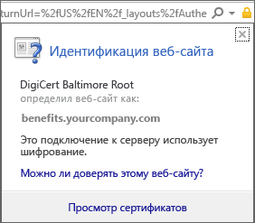
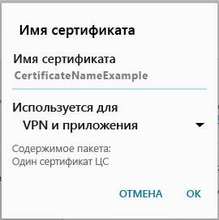

# Устройство не имеет необходимого сертификата

## На устройстве отсутствует сертификат, который обычно уже установлен на телефоне
Если устройство Android не зарегистрировано в Intune и на нем отсутствует сертификат, который обычно уже установлен на телефоне, вы не сможете войти в приложение корпоративного портала Android. При попытке выполнить вход вы увидите следующее сообщение:

Чтобы устранить эту проблему и получить требуемый сертификат, выполните следующие действия:

1.  В браузере перейдите на [страницу сертификата Digicert](https://www.digicert.com/digicert-root-certificates.htm).

2.  Найдите и скачайте сертификат Baltimore CyberTrust Root (https://www.digicert.com/CACerts/BaltimoreCyberTrustRoot.crt).

3.  Перетащите верхнюю панель вниз, чтобы открыть уведомления, и выберите **BaltimoreCyberTrustRoot.crt** в списке уведомлений.

4.  На экране **Имя сертификата** примите имя сертификата по умолчанию.

5. Убедитесь, что для параметра **Credential Use** (Использование учетных данных) задано значение **Used for VPN and apps** (Использовать для VPN и приложений), и нажмите кнопку **ОК**.

    

6. Закройте веб-браузер и приложение корпоративного портала.

7. Снова откройте приложение корпоративного портала. Теперь вы сможете войти в приложение корпоративного портала. Если вам нужна помощь, обратитесь к системному администратору.

## На устройстве отсутствует сертификат, необходимый для администратора ИТ
Если устройство Android не зарегистрировано в Intune и на нем отсутствует сертификат, который необходим для администратора ИТ, вы не сможете войти в приложение корпоративного портала Android. При попытке войти вы увидите следующее сообщение:

>[!NOTE]
> Если вы уже видели одно сообщение об отсутствии сертификата и выполнили шаги, описанные в разделе [На устройстве отсутствует сертификат, который обычно уже установлен на телефоне](#your-device-is-missing-a-certificate-that-usually-comes-installed-on-your-phone), это нестрашно. Это другое сообщение и другой сертификат. Поэтому выполните шаги в этом разделе, чтобы получить отсутствующий сертификат.

Чтобы решить возникшую проблему и получить необходимый сертификат, нужно выполнить два основных шага:

- определить отсутствующий сертификат, просмотрев сертификаты на компьютере компании или учебном компьютере;
- использовать свое устройство для скачивания отсутствующего сертификата из Интернета.

### Определение отсутствующего сертификата путем просмотра сертификатов на компьютере компании или учебном компьютере

1. На компьютере откройте Internet Explorer. Если у вас нет компьютера, обратитесь к администратору ИТ. Его контактные данные доступны на [веб-сайте корпоративного портала](http://portal.manage.microsoft.com).

2. Перейдите на [веб-сайт корпоративного портала](http://portal.manage.microsoft.com) и войдите на портал, используя рабочие или учебные учетные данные.

3. Справа от адресной строки браузера щелкните символ в виде замка, как показано ниже. Если вы не видите его, остановитесь и обратитесь к администратору ИТ. Символ в виде замка означает, что выполнен безопасный вход. Поэтому не следует продолжать работу, если он не отображается.

    

4. Щелкните **Просмотр сертификатов**.

    

5. В диалоговом окне **Сертификат** щелкните вкладку **Путь сертификации** и укажите сертификат, который необходимо получить из Интернета. Имя нужного сертификата будет находиться там же, где находится выделенное имя на примере снимка экрана выше.

### Скачивание и установка отсутствующего сертификата на мобильное устройство Android

1. Найдите имя отсутствующего сертификата, определенного в предыдущем разделе, используя поисковую систему, например Bing или Google. У сертификата могут быть различные расширения, например CRT, PEM и т. п.

2. Скачайте корневой сертификат с веб-сайта.

3. После скачивания сертификата перетяните верхнюю панель вниз, чтобы открыть уведомления, а затем выберите имя сертификата в списке уведомлений.

4. В диалоговом окне **Name the Certificate** (Имя сертификата), показанном ниже, примите имя сертификата по умолчанию.

5. Убедитесь, что для параметра **Credential Use** (Использование учетных данных) задано значение **Used for VPN and apps** (Использовать для VPN и приложений), и нажмите кнопку **ОК**.

    

6. Закройте приложение корпоративного портала.

7. Снова откройте приложение корпоративного портала. Теперь вы сможете войти в приложение корпоративного портала. Если вам нужна помощь, обратитесь к системному администратору.

Если вы видите сообщение об отсутствующем сертификате, которое показано выше, но уже выполнили приведенные здесь шаги, вероятно, необходим другой сертификат, для установки которого нужна помощь администратора ИТ. Обратитесь к администратору ИТ и предоставьте ему эту [ссылку](/intune/troubleshoot/troubleshoot-device-enrollment-in-intune#android-certificate-issues). Здесь содержатся шаги, которые помогут решить проблему.

<!--HONumber=Sep16_HO3-->

