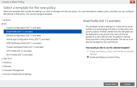
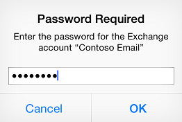

---
# required metadata

title: Настройка доступа к электронной почте для устройств iOS с помощью Microsoft Intune | Microsoft Intune
description:
keywords:
author: Staciebarker
manager: jeffgilb
ms.date: 04/28/2016
ms.topic: article
ms.prod:
ms.service: microsoft-intune
ms.technology:
ms.assetid: 3853673d-290a-400f-8e45-d55e39d42acd

# optional metadata

#ROBOTS:
#audience:
#ms.devlang:
ms.reviewer: jeffgilb
ms.suite: ems
#ms.tgt_pltfrm:
#ms.custom:

---

# Настройка доступа к электронной почте для устройств iOS с помощью Microsoft Intune
При регистрации устройств в Intune их можно настроить так, чтобы пользователи могли получить доступ к электронной почте компании. Один из способов такой настройки для определенных типов устройств заключается в создании и развертывании **профиля электронной почты**. Профили электронной почты — это своего рода политика Intune, которая настраивает устройство и подключает его к службе электронной почты компании.
Использование такого профиля автоматизирует доступ к электронной почте для зарегистрированных устройств, устраняя потребность в ручной настройке. Кроме того, профиль электронной почты гарантирует, что для разных пользователей доступ настраивается единообразно и с одинаковыми основными параметрами.

## Цели этого пошагового руководства

- Создание и развертывание профиля электронной почты для устройств iOS
- Проверка успешного применения политики профиля электронной почты

## Необходимые условия для работы с этим пошаговым руководством

- Exchange Server — локальный или размещенный в Azure в рамках подписки Office/E3.
- Имя узла для сервера Exchange вашей компании. Это полное доменное имя (FQDN), например **contosodemo55.onmicrosoft.com**.
- Группа пользователей, для которой нужно развернуть профиль электронной почты. Если вы выполнили пошаговое руководство [Запуск пробной версии Microsoft Intune и развертывание политики iOS в отношении ПИН-кодов](start-a-microsoft-intune-trial-and-deploy-ios-pin-policy.md), то можете использовать созданную при этом группу пользователей **GroupDemo**.
- Зарегистрированные устройства iOS, на которых требуется развернуть профиль. Опять же, если вы выполнили пошаговое руководство [Запуск пробной версии Microsoft Intune и развертывание политики iOS в отношении ПИН-кодов](start-a-microsoft-intune-trial-and-deploy-ios-pin-policy.md), то уже зарегистрировали несколько устройств iOS.

## Шаги по созданию и развертыванию профиля электронной почты для устройств iOS

В этом пошаговом руководстве мы используем размещенный сервер Exchange, входящий в пробную подписку.
1. В консоли Intune щелкните **Политика**, а затем нажмите кнопку **Добавить политику**

2. В диалоговом окне **Создать новую политику** разверните узел **iOS**, выберите **Профиль электронной почты** и нажмите кнопку **Создать политику**

3. На странице создания политики введите имя для политики, например **Профиль электронной почты iOS — пользователь/пароль**, и описание. Может потребоваться несколько профилей электронной почты для различных типов устройств и методов проверки подлинности, поэтому имя может иметь описательный характер.
4. Введите имя узла Exchange. Так как мы используем сервер Exchange, размещенный в Azure, в качестве имени узла мы просто вводим: **outlook.office365.com**.](./media/Email-Walkthrough/Email-Walkthrough-3.png)
5. <add-exchange-host-name> Введите имя учетной записи, которое будет отображаться пользователям устройства, чтобы упростить идентификацию службы электронной почты.
6. Например, **Contoso Email**.
7. Так как мы используем имя пользователя и пароль в целях проверки подлинности пользователя для службы Exchange, просто оставьте параметры имени пользователя и пароля без изменений. Настройте параметры синхронизации нужным образом.  
8. Если потребность в изменении конкретных параметров отсутствует, просто используйте значения по умолчанию.
9. Нажмите кнопку **Сохранить политику**. Отображается диалоговое окно с запросом на развертывание политики.

10. <deploy-policy-now-dialog>
![В появившемся окне выберите группу пользователей, для которой требуется развернуть профиль электронной почты, нажмите кнопку **Добавить**, а затем кнопку **ОК**.

## <finish-add-policy>

Через одну-две минуты после нажатия кнопки **ОК** начинается распространение политики на устройства.
1. Шаги по проверке успешного применения профиля
Чтобы убедиться, что профиль был применен, потребуется доступ к одному из устройств, на которых он был развернут.

2. Приложение выводит запрос имени пользователя и пароля для электронной почты.
 <verify-policy-add-password>

3. Открывается приложение "Почта" с учетной записью Exchange, и начинается синхронизация электронной почты на устройстве.

<!--HONumber=May16_HO2-->

