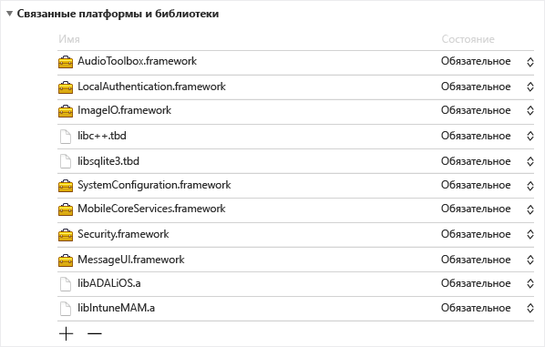
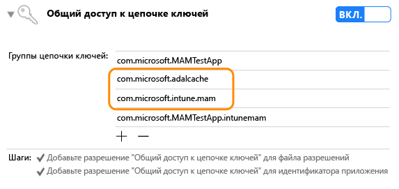

# Руководство по пакету SDK для приложений Intune для разработчиков под iOS

> [!NOTE]
> Вы можете сначала прочесть статью [Руководство по началу работы с пакетом SDK для приложений Intune](intune-app-sdk-get-started.md), в которой описана подготовка к интеграции на каждой поддерживаемой платформе *. 

Пакет SDK для приложений Microsoft Intune для iOS позволяет встроить в ваше приложение iOS функции управления мобильными приложениями (MAM). Приложение с поддержкой MAM интегрировано с пакетом SDK для приложений Intune и позволяет ИТ-администраторам развертывать политики для мобильного приложения во время активного управления им.

## Состав пакета SDK

Пакет SDK для приложений Intune для iOS содержит статическую библиотеку, файлы ресурсов, заголовки API, PLIST-файл параметров отладки и средство конфигуратора. Мобильные приложения для большинства применяемых политик могут включать просто файлы ресурсов и статическую компоновку с библиотеками для большинства применения политики. Расширенные функции Intune MAM применяются через API-интерфейсы.
В этом руководстве рассматривается использование следующих компонентов при интеграции пакета SDK для приложений Intune для iOS:

* **`libIntuneMAM.a`**: библиотека по пакету SDK для приложений Intune. Свяжите эту библиотеку со своим проектом, чтобы включить в мобильном приложении поддержку MAM. Инструкции приведены ниже в разделе "Создание приложения с помощью пакета SDK для приложений Intune".

* **`IntuneMAMResources.Bundle`**: набор ресурсов, на которых основан пакет SDK. 

* **Заголовки**: предоставляет API пакета SDK для приложений Intune. При использовании API необходимо включить файл заголовков, содержащий этот API. 

## Принцип работы пакета SDK для приложений Intune

Назначение пакета SDK для приложений Intune для iOS заключается в том, чтобы добавить возможности управления в приложения iOS с минимальными изменениями кода. Сокращение объема изменений кода уменьшает время выхода на рынок, одновременно повышая согласованность и стабильность работы мобильного приложения. 

Приложение должно быть связано со статической библиотекой и включать в себя набор ресурсов. Файл MAMDebugSettings.plist является необязательным и может быть включен в пакет для имитации применяемых к приложению политик MAM, при этом развертывание приложения с помощью Microsoft Intune не требуется. Кроме того, в отладочных сборках политики в файле MAMDebugSettings.plist могут применяться посредством передачи файла MAMDebugSettings.plist в каталог "Documents" приложения через совместный доступ к файлам в iTunes.

## Создание приложения с помощью пакета SDK для приложений Intune 

Выполните следующие шаги, чтобы включить пакет SDK для приложений Intune:

1. Выполните связывание с библиотекой `libIntuneMAM.a` следующим образом:

    Перетащите библиотеку libIntuneMAM.a в список "Linked Frameworks and Libraries" (Связанные платформы и библиотеки) цели проекта.  

    
 
    **Примечание.**При публикации в магазине приложений используйте ту версию libIntuneMAM.a, которая создана для окончательной, а не отладочной версии. Окончательная версия будет находиться в папке "release". Отладочная версия имеет подробные выходные данные, которые хорошо подходят для отладки проблем с пакетом SDK для приложений Intune.

2. Добавьте в проект следующие платформы iOS (если они отсутствуют).
    * `MessageUI.framework`
    * `Security.framework`
    * `MobileCoreServices.framework`
    * `SystemConfiguration.framework`
    * `libsqlite3.dylib`
    * `libc++.dylib`
    * `ImageIO.framework`
    * `LocalAuthentication.Framework`
    * `AudioToolbox.framework` 

    **Примечание.**. Если приложение предназначено для iOS7, установите для атрибута "Состояние" в `LocalAuthentication.Framework` значение "Дополнительно". 

    Если атрибут "Состояние" не задан, приложение не запустится в iOS7.

    **Примечание.**. Для Xcode 7 расширения `.dylib` изменились на `.tbd`.

3. Добавьте набор ресурсов `IntuneMAMResources.bundle` в проект, перетащив этот набор ресурсов в узел "Copy Bundle Resources" (Копирование ресурсов пакета) раздела "Build Phases" (Этапы сборки). 

    

4. Добавьте `-force_load {PATH_TO_LIB}/libIntuneMAM.a` в любое из следующих расположений, заменив `{PATH_TO_LIB}` путем к пакету SDK для приложений Intune:
    * параметр конфигурации сборки проекта OTHER_LDFLAGS; 
    * "Other Linker Flags" (Другие флаги компоновщика) в пользовательском интерфейсе. 

    **Примечание.**. Чтобы найти `PATH_TO_LIB`, выберите файл `libIntuneMAM.a` , а затем выберите пункт "Получить сведения" в меню "Файл". Скопируйте и вставьте сведения "Где" (путь) из раздела "Общие" окна "Сведения".

5. Если ваше мобильное приложение определяет главный Nib или Storyboard в своем `info.plist`, удалите поля файла "Main Storyboard" или "Main Nib". Добавьте удаленные ранее значения Storyboard или Nib в новый словарь `IntuneMAMSettings` со следующими именами ключей, если применимо:
    * `MainStoryboardFile`
    * `MainStoryboardFile~ipad`
    * `MainNibFile`
    * `MainNibFile~ipad `
    
    Если ваше мобильное приложение не определяет главный Nib или Storyboard в своем `info.plist`, эти параметры являются **необязательными**. 

    **Примечание.**. Можно просмотреть `info.plist` в необработанном формате (чтобы увидеть имена ключей), щелкнув правой кнопкой мыши в любом месте в основном тексте документа и изменив тип представления на "Show Raw Keys/Values" (Показать необработанные ключи/значения).

6. Включите общий доступ к цепочке ключей (если он еще не включен), щелкнув "Возможности" в каждой цели проекта и включив параметр "Keychain Sharing" (Общий доступ к цепочке ключей). Общий доступ к цепочке ключей требуется для перехода к следующему шагу.

    **Примечание**. Профиль подготовки должен поддерживать новые значения общего доступа к цепочке ключей. Группы доступа к цепочке ключей должны поддерживать подстановочный знак. Это можно проверить, открыв файл `.mobileprovision` в текстовом редакторе, найдя "keychain-access-groups" и убедившись в наличии подстановочного знака, например: 

       <key>keychain-access-groups</key>
       <array>
       <string>YOURBUNDLESEEDID.*</string>
       </array>

7. После включения общего доступа к цепочке ключей выполните следующие действия для создания отдельной группы доступа, в которой будут храниться данные пакета SDK для приложений Intune. Группу доступа к цепочке ключей можно создать с помощью пользовательского интерфейса или с помощью файла прав:

    Создание группы доступа к цепочке ключей с помощью пользовательского интерфейса: 
    
    * Если для мобильного приложения не определено ни одной группы доступа к цепочке ключей, добавьте идентификатор пакета приложения в качестве первой группы.
    * Добавьте группу общей цепочки ключей com.microsoft.intune.mam. Эта группа доступа используется пакетом SDK для приложений Intune для хранения данных.  
    * Добавьте набор ресурсов `com.microsoft.adalcache` в свои существующие группы доступа. 
 
    

    Если для создания группы доступа к цепочке ключей вы используете файл прав, а не стандартный пользовательский интерфейс, необходимо добавить `$(AppIdentifierPrefix)` в начало этой группы доступа к цепочке ключей в файле прав. Например, `$(AppIdentifierPrefix)com.microsoft.intune.mam` и `$(AppIdentifierPrefix)com.microsoft.adalcache`.

    **Примечание**. Файл прав — это уникальный для вашего мобильного приложения XML-файл, который используется для задания специальных разрешений и возможностей в приложении iOS.

8. Для мобильных приложений, разрабатываемых для iOS 9+, необходимо включить каждый протокол, который передает ваше мобильное приложение, в `UIApplication canOpenURL` в массиве `LSApplicationQueriesSchemes` файла `info.plist` мобильного приложения. Кроме того, для каждого из указанных протоколов следует добавить новый протокол, добавив к нему суффикс `-intunemam`. Следует также включить `http-intunemam`, `https-intunemam`и `ms-outlook-intunemam` в этот массив. 

9. Если приложение определяет схемы URL-адресов в своем `info.plist file`, добавьте другую схему с суффиксом `-intunemam` для каждой схемы URL-адресов.

10. Если в файле прав приложения определены группы приложений, добавьте эти группы в словарь `IntuneMAMSettings` ключа `AppGroupIdentitifiers` в виде массива строк.

11. Свяжите мобильное приложение с библиотекой ADAL. Библиотека ADAL для Objective C доступна [на сайте Github](https://github.com/AzureAD/azure-activedirectory-library-for-objc).

    **Примечание**. Пакет SDK для приложений Intune был проверен на соответствие коду ветви брокера ADAL от 19.06.2015. Убедитесь, что связывание производится с последней или рабочей версией библиотеки ADAL.

12. Включите набор ресурсов `ADALiOSBundle.bundle resource` в проект, перетащив его в узел "Copy Bundle Resources" (Копирование ресурсов пакета) раздела "Build Phases" (Этапы сборки).

13. Используйте параметр компоновщика `-force_load PATH_TO_ADAL_LIBRARY` при связывании с библиотекой.

    Добавьте `-force_load {PATH_TO_LIB}/libADALiOS.a` OTHER_LDFLAGS в параметр конфигурации сборки проекта OTHER_LDFLAGS; или в "Other Linker Flags" (Другие флаги компоновщика) в пользовательском интерфейсе. PATH_TO_LIB следует заменить на расположение двоичных файлов ADAL. 

Если мобильное приложение использует ADAL для собственной проверки подлинности, просмотрите находящийся здесь раздел "Настройка параметров библиотеки проверки подлинности Azure Directory".

### Телеметрия 

Пакет SDK для приложений Intune для iOS регистрирует данные телеметрии для событий использования по умолчанию, а затем отправляет их в Microsoft Intune.

Данные регистрируются для следующих событий использования: 

1. Запуск приложения с целью предоставить Microsoft Intune сведения об использовании приложений с поддержкой MAM по типу управления.

2. Вызов API EnrollApplicationс целью предоставить Microsoft Intune сведения об уровне успешности и других метриках производительности вызова enrollApplication со стороны клиента.

**Примечание.**. Если вы решили не отправлять данные телеметрии пакета SDK для приложений Intune в Microsoft Intune из своего мобильного приложения, **необходимо отключить** фиксирование данных телеметрии пакета SDK, задав значение "YES" для свойства `MAMTelemetryDisabled` в `IntuneMAMSettings`.

## Настройка параметров библиотеки проверки подлинности Azure Directory (ADAL) (дополнительно)

Пакет SDK для приложений Intune использует ADAL для своего сценария проверки подлинности и условного запуска. Как правило, ADAL требует, чтобы приложение было зарегистрировано и получило уникальный идентификатор — `ClientID`, а также другие идентификаторы, чтобы гарантировать безопасность токенов, предоставленных этому приложению. Пакет SDK для приложений Intune использует значения регистрации по умолчанию при подключении к Azure Active Directory.  Если приложение использует ADAL для своего сценария проверки подлинности, оно должно использовать существующие значения регистрации и переопределять значение по умолчанию в пакет SDK для приложений Intune, чтобы избежать двойной проверки подлинности конечных пользователей (один раз пакетом SDK для приложений Intune и один раз приложением). 

Описанные ниже действия необходимы, если приложение использует ADAL для собственной проверки подлинности. Если мобильное приложение не использует ADAL, никаких дополнительных действий не требуется. 

1. В словаре `Info.plist`с именем ключа `IntuneMAMSettings` в файле `ADALClientId`проекта укажите `ClientID` , используемый для вызовов ADAL. 

2. В словаре `Info.plist`с именем ключа `IntuneMAMSettings` в файле `ADALRedirectUri`проекта укажите URI перенаправления, используемый для вызовов ADAL. В зависимости от формата URI перенаправления приложения можно также указать `ADALRedirectScheme` .

### Создание расширений (дополнительно) 

При создании расширений руководствуйтесь инструкциями по созданию мобильного приложения, описанными в приведенном здесь разделе "Создание приложения с помощью пакета SDK для приложений Intune". Кроме того, обновите файл info.plist каждого расширения, чтобы добавить ключ ContainingAppBundleId в словаре IntuneMAMSettings со значением идентификатора пакета, содержащего приложения.

### Создание платформ (дополнительно)

В результате последних изменений в пакете SDK для приложений Intune вам не требуется компилировать мобильное приложение с какими-либо определенными флагами компоновщика, если мобильное приложение содержит внедренные платформы приложений. 

### Файлы изображений при запуске (дополнительно)

Если приложение с поддержкой MAM активно управляется Microsoft Intune, пакет SDK для приложений Intune будет отображать заставку при запуске приложения, чтобы уведомить пользователя о том, что приложение является управляемым. При необходимости вы можете добавить файлы изображений для отображения на стартовой странице "Управляется вашей организацией". Соблюдайте следующие правила для использования изображений:

* Добавьте имена файлов в словарь `IntuneMAMSettings` в файле info.plist приложения с именами ключей `SplashIconFile` и `SplashIconFile~ipad`. 

* Размер изображения и требования:

    * 180 x 180 для iPhone 6s Plus и iPhone 6 Plus, 120 x 120 для других моделей iPhone и 152 x 152 для iPad. 
    
    * Удалите расширение `.png` из имен файлов. 
    
    * Используйте параметр компоновщика `@2x` для версий двукратным масштабированием файлов изображений и суффикс `@3x` для версий трехкратным масштабированием. Если изображения имеют неподходящий размер, их масштаб будет соответствующим образом изменен. Если значения SplashIconFile не указаны, пакет SDK для приложений Intune выбирает один из значков приложения (60 x 60 для всех iPhone, 76 x 76 для iPad).

**Примечание**. Этот экран инициируется запуском, но может быть окончательно закрыт пользователем.

## Настройка параметров пакета SDK для приложений Intune

Словарь `IntuneMAMSettings` , содержащийся в файле `info.plist` приложения, используется для настройки пакета SDK для приложений Intune. Ниже приведен список всех поддерживаемых параметров. 

Некоторые из этих параметров уже описаны в предыдущих разделах, а некоторые применяются не ко всем приложениям. 

Параметр  | Тип  | Определение | Необходим?
--|--|--|--
ADALClientId  | Строка  | Идентификатор клиента AAD приложения. | Требуется, если приложение использовало ADAL.
ADALRedirectUri  | Строка  | URI перенаправления AAD приложения. | Требуется, если приложение использовало ADAL. 
AppGroupIdentifier | Массив строк  | Массив групп приложений из раздела com.apple.security.application-groups прав приложения. | Требуется, если приложение использует группы приложений.
ContainingAppBundleId  | Строка | Указывает идентификатор пакета содержащего приложения расширения. | Требуется для расширений iOS.
MainNibFile MainNibFile~ipad  | Строка  | Этот параметр должен содержать имя главного файла NIB приложения.  | Требуется, если приложение определяет MainNibFile в своем файле info.plist.
MainStoryboardFile MainStoryboardFile~ipad  | Строка  | Этот параметр должен содержать имя главного файла STORYBOARD приложения. | Требуется, если приложение определяет UIMainStoryboardFile в своем файле info.plist.
SplashIconFile  SplashIconFile~ipad  | Строка  | Задает файл значка заставки Intune. Дополнительные сведения см. в приведенном здесь разделе "Файлы изображений при запуске". | Необязательный параметр.
SplashDuration | Число | Минимальное количество времени в секундах, в течение которого экран-заставка Intune отображается при запуске приложения. По умолчанию используется значение 1,5. | Необязательный параметр.
ADALLogOverrideDisabled | Логическое значение  | Указывает, будет ли пакет SDK перенаправлять все журналы ADAL (включая вызовы ADAL из приложения при их наличии) в свой файл журнала. По умолчанию используется значение NO (Нет). Задайте значение YES (Да), если приложению требуется выполнить собственный обратный вызов журнала ADAL. | Необязательный параметр.

## Заголовки для пакета SDK для приложений Intune 

Следующие заголовки включают в себя вызовы функций API, необходимые для использования функциональных возможностей пакета SDK для приложений Intune. 

    IntuneMAMAsyncResult.h
    IntuneMAMDataProtectionInfo.h
    IntuneMAMDataProtectionManager.h
    IntuneMAMFileProtectionInfo.h
    IntuneMAMFileProtectionManager.h
    IntuneMAMPolicyDelegate.h
    IntuneMAMLogger.h

## Отладка пакета SDK для приложений Intune в Xcode

Перед тестированием приложения с поддержкой MAM с помощью Microsoft Intune вы можете воспользоваться `Settings.bundle` при работе в Xcode. Это позволит вам задать политики тестирования без подключения к Intune. Чтобы включить эту функцию, выполните следующие действия:

* Добавьте `Settings.bundle` , щелкнув правой кнопкой мыши папку верхнего уровня в проекте. Выберите "Добавить -> Новый файл" в меню. Выберите шаблон "Settings Bundle" (Пакет параметров) в разделе "Ресурсы" для его добавления.

* Только в отладочных сборках — скопируйте `MAMDebugSettings.plist` в `Settings.bundle`.

* В `Root.plist` (Settings.bundle) добавьте предпочтение дочерней области "Тип", "Имя_файла" `MAMDebugSettings`.

* В разделе "Параметры -> Имя_вашего_приложения" настройте параметр "Enable Test Policies" (Включить политики тестирования).

* Запустите приложение (внутри Xcode либо за его пределами). 

* В разделе "Параметры -> Имя_вашего_приложения -> Enable Test Policies" (Включить политики тестирования) настройте политику, например "ПИН-код".

* Запустите приложение (внутри Xcode либо за его пределами). Убедитесь, что политика "ПИН-код" работает правильно.

> [!NOTE]
> Теперь для включения и настройки параметров можно использовать меню "Параметры -> Имя_вашего_приложения -> Включить политики тестирования".

## Рекомендации и советы для iOS

Ниже приведены некоторые рекомендации по разработке для iOS:

Файловая система iOS чувствительна к регистру. Убедитесь, что имена файлов, такие как `libIntuneMAM.a` и `IntuneMAMResources.bundle`.

Если Xcode не удается найти `libIntuneMAM.a`, можно устранить данную проблему, добавив путь к этой библиотеке в пути поиска компоновщика.

<!--HONumber=Aug16_HO5-->

